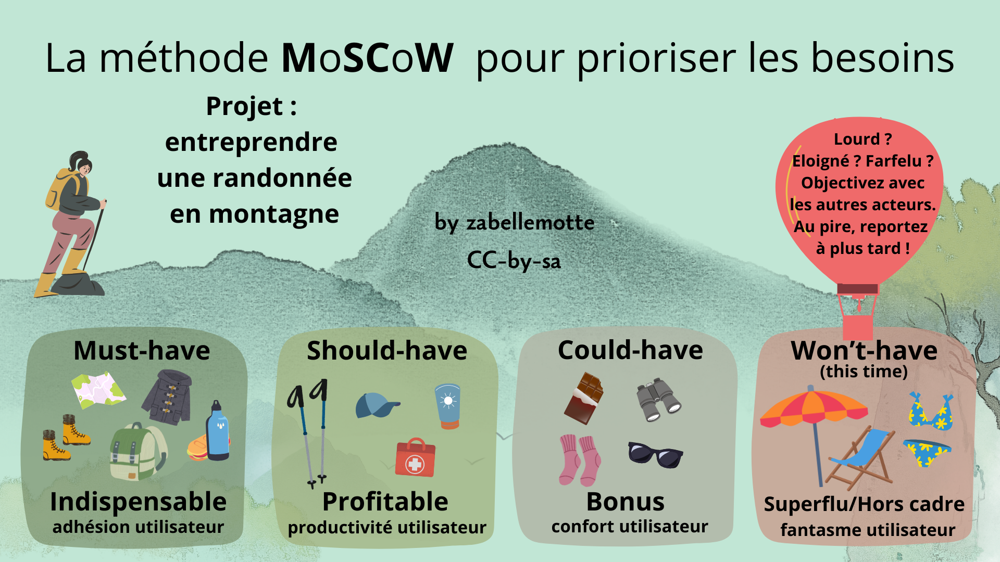
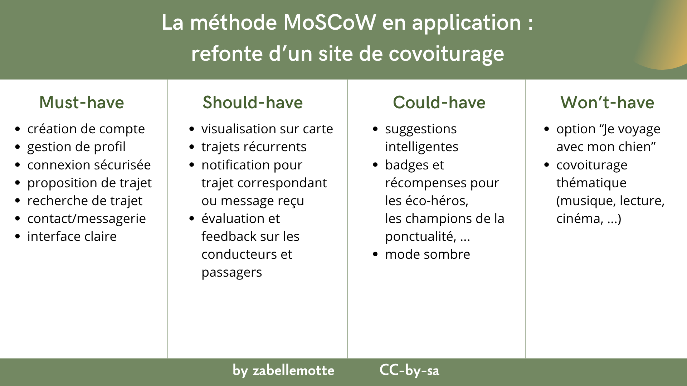

# Prioriser les besoins avec la méthode MoSCoW

<h4 id="survol">En un coup d'oeil </h4>

    

      
    

    

        <dl class="zab-method-dl">
            <dt>Etape UX</dt>
            <dd>1. Planification</dd>
            <dt>Catégorie</dt>
            <dd>Gestion de projet</dd>
            <dt>Intérêt</dt>
            <dd>Prioriser les besoins des utilisateurs dans le cadre de la refonte d'un produit ou d'un processus</dd>
            <dt>Complexité</dt>
            <dd>Facile</dd>
            <dt>Durée</dt>
            <dd>Quelques heures</dd>
            <dt>En vidéo</dt>
            <dd><a href="https://www.youtube.com/watch?v=914dkGItq1Y" target="_blank">MoSCoW priorization for your product backlog (Railsware Product Studio)</a></dd>
        </dl>
    

  

<ul>
<li> <a href="#resume"> En résumé </a></li>
<li> <a href="#comment">Comment l'appliquer ?</a> </li>
<li> <a href="#exemple">Exemple concret</a> </li>
<li> <a href="#variantes">Variantes</a> </li>
<li> <a href="#limites">Limites</a> </li>
<li> <a href="#astuce">Astuce</a> </li>
<li> <a href="#histoire">La petite histoire</a> </li>
</ul>

<h4 id="resume"> En résumé</h4>
La méthode MoSCoW propose de classifier les besoins selon 4 catégories:
<ul>
<li> <b>M</b>ust-have ou Indispensable : besoin essentiel et critique pour le projet, ne pas y répondre serait un échec </li>
<li> <b>S</b>hould-have ou Profitable : besoin secondaire qui peut être rencontré plus tard, qui facilite beaucoup le travail des utilisateurs </li>
<li> <b>C</b>ould-have ou Bonus : besoins désirable non nécessaire mais qui apporte un confort à l'utilisateur</li>
<li> <b>W</b>on't have this time ou Superflu/Hors cadre : besoin qui sort du périmètre du projet (trop lourd, trop éloigné, voire farfelu) qu'on abandonne au moins dans un premier temps </li>
</ul>
Les "o" de l'acronyme sont ajoutés pour faciliter la prononciation.

Cette méthode s'applique particulièrement bien dans le cadre de la refonte d'un produit ou d'un processus car les utilisateurs ont déjà un usage du produit et sont en mesure d'évaluer le bénéfice de chaque option.

<h4 id="comment"> Comment l'appliquer ? </h4>
L'analyse des priorités peut être réalisée lors d'une réunion réunissant les principaux acteurs du projet.   
Les étapes pour appliquer cette méthode sont les suivantes :
<ol>
<li> Identifier les besoins des différents acteurs (en les rencontrant individuellement par exemple)</li>
<li> Organiser une réunion avec les acteurs du projet, leur présenter les besoins indentifiés et leur présenter la méthode</li>
<li> Classer les besoins avec la méthode MoSCow</li>
<li> Analyser le résultat de manière globale et comparer les besoins 2 à 2 pour vérifier le classement </li>
<li> Valider les priorités avec tous les acteurs</li>
<li> Prévoir la possibilité de modifier les besoins et priorités au cours du projet (parce que quand le projet se concrétise, des éléments oubliés émergent)</li>
</ol>

<h4 id="exemple"> Exemple concret </h4>

 Pour la refonte d'un site de covoiturage, les fonctionnalités qui doivent être intégrées peuvent être priorisées avec la méthode MoSCoW comme suit :

 L'ancien service repose sur une série de fonctionnalités indispensables, comme le fait de pouvoir créer un compte, de pouvoir définir ou rechercher des trajets. Il est profitable de mettre en place un système de notifications et d'évaluation des utilisateurs. En bonus, le site pourrait intégrer des suggestions intelligentes. 
Mais, il n'est sans doute pas utile de prévoir des options du genre "voyager avec son chien" ou "covoiturage thématique cinéma".

<h4 id="variantes"> Variantes </h4>

Lorsqu'il faut mettre d'accord plusieurs acteurs, la méthode MoSCoW peut être utilisée pour établir les priorités de chacun puis établir le niveau de priorité moyen via des moyennes. 
Si les acteurs n'ont pas le même poids dans le projet (parce qu'ils n'ont pas le même usage de l'outil), les moyennes peuvent être pondérées par un facteur de poids lié à chaque acteur.

<h4 id=variantes"> Limite </h4>

 Les utilisateurs peuvent avoir tendance à indiquer que tous leurs besoins sont des must-have. Dans le cas de la refonte d'un produit, les must-have peuvent être cadrés sur base des options dont ils disposent déjà. C'est la raison pour laquelle cette méthode est plutôt conseillée pour ce cas d'usage. 

<h4 id="histoire"> La petite histoire </h4>

La méthode MoSCoW a été créée par Dai Clegg au milieu des années 1990. Elle a été développée dans le cadre du projet DSDM (Dynamic Systems Development Method), une méthode agile britannique antérieure à Scrum.
DSDM est un des premiers cadres de développement agile formalisés (1994), et la méthode MoSCoW y a été intégrée pour aider à hiérarchiser les exigences.

<h6> Cet article et ses illustrations sont partagées sous licence <a href="https://creativecommons.org/licenses/by-sa/4.0/deed.fr" target="_blank">Creative Commons-by-sa</a>. </h6> 