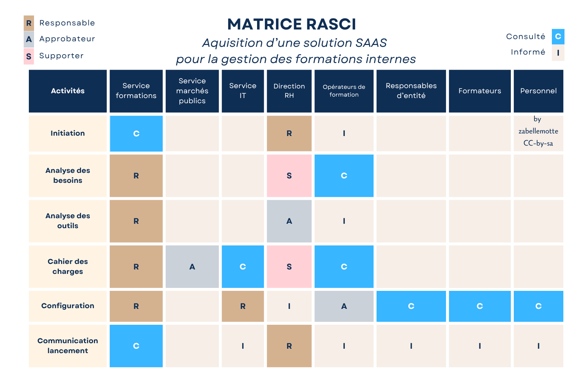

# Cartographier les parties prenantes avec la matrice RACI ou RASCI

<h4 id="survol">En un coup d'oeil </h4>

    

      
    

    

        <dl class="zab-method-dl">
            <dt>Etape UX</dt>
            <dd>1. Planification</dd>
            <dt>Catégorie</dt>
            <dd>Gestion de projet</dd>
            <dt>Intérêt</dt>
            <dd>Identifier les acteurs du projet et définir leurs responsabilités</dd>
            <dt>Complexité</dt>
            <dd>Facile</dd>
            <dt>Durée</dt>
            <dd>Quelques heures</dd>
            <dt>En vidéo</dt>
            <dd><a href="https://www.youtube.com/watch?v=Rbg0G-IUhqs" target="_blank">La matrice des responsabilités RASCI (Actualisation TV)</a></dd>
        </dl>
    

  

<ul>
<li> <a href="#resume"> En résumé </a></li>
<li> <a href="#comment">Comment l'appliquer ?</a> </li>
<li> <a href="#exemple">Exemple concret</a> </li>
<li> <a href="#variantes">Variantes</a> </li>
<li> <a href="#limites">Limites</a> </li>
<li> <a href="#astuce">Astuce</a> </li>
<li> <a href="#histoire">La petite histoire</a> </li>
</ul>

<h4 id="resume"> En résumé</h4>
La matrice d'affectation des responsabilités ou matrice d'autorité croise différentes tâches ou étapes du projet avec les acteurs pour identifier leurs responsabilités.
Les responsabilités se déclinent selon l'acronyme RACI ou RASCI:
<ul>
<li> <b>R</b>esponsable : Réalise la tâche </li>
<li> <b>A</b>pprobateur : Approuve le travail effectué</li>
<li> <b>S</b>upporter : Soutien la mise en oeuvre</li>
<li> <b>C</b>onsulté : Contribue à la clarification de la tâche</li>
<li> <b>I</b>nformé : Doit être informé de l'avancement de la tâche</li>
</ul>

<h4 id="comment"> Comment l'appliquer ? </h4>
La matrice peut être réalisée par le chef de projet ou lors d'une réunion réunissant les principaux acteurs du projet.   
Les étapes pour la composer sont les suivantes :
<ol>
<li> Identifier les étapes ou tâches liées à la réalisation du projet</li>
<li> Identifier tous les acteurs du projet</li>
<li> Composer la matrice et définir les responsabilités</li>
<li> Identifier et corriger les lacunes et chevauchements </li>
<li> Vérifier que la matrice est conforme aux règles suivantes :
   <ul> <li> un seul A par ligne sinon subdiviser en 2 tâches </li>
        <li> au moins un R pour chaque ligne  </li>
   </ul>
</li>
<li> Valider la matrice avec les principaux acteurs du projet</li>
</ol>

<h4 id="exemple"> Exemple concret </h4>

Dans une institution où la formation interne est portée par différents opérateurs de formation indépendants, on souhaite mettre en place une application unique pour la gestion des formations intenes.

La solution ne sera pas développée en interne mais l'idée est d'adopter une solution disponible sur le marché sous forme de service SAAS pour lequel l'institution souhaite souscrire à un abonnement.

Les opérateurs de formation interne seront très mobilisés tout au long du projet car ils travaillaient en toute autonomie et doivent à présent accepter de travailler avec une application commune.

Et d'autres acteurs seront aussi consultés plus en aval, comme les responsables d'entité qui auront une vue sur les formations de leur entité ou les formateurs qui seront amenés à réaliser quelques actiions de gestion dans l'application. 

Finalement, les représentants du personnel seront amenés à tester l'application en primeur avant son lancement pour détecter si des adaptations sont nécessaires. 

<h4 id="variantes"> Variantes </h4>
Les variantes de la matrice des responsabilités peuvent induire d'autres rôles :
<ul>
<li> <b>Q</b>uality manager : Vérifie la qualité du produit </li>
<li> <b>P</b>olitique : Apporte un soutien stratégique (pour distinguer ce rôle du rôle de supporter qui apporte des ressources au projet)</li>
</ul>
Et d'autres rôles peuvent être intégrés si pertinents ...

<h4 id="limites"> Limites</h4>

La matrice des responsabilités est adaptée à une analyse macro pour définir les reponsabilités des différents grands acteurs au début d'un projet.

 Vous en trouverez des variantes plus micro, dédicacée à la répartition des tâches entre les différents membres d'une équipe projet. La déclinaison micro de la méthode RASCI peut alourdir la matrice et s'avérer peu pratique. D'autres approches plus adaptées sont abordées dans la partie  <a href="4aaaa.html">4. Design</a>

<h4 id="astuce"> Astuce </h4>

 Les visuels de cette page ont été réalisés à partir du modèle "matrice RACI" proposé sur le site <a href="https://www.canva.com" target="_blank">canva.com</a> sans nécessiter d'abonnement payant.

<h4 id="histoire"> La petite histoire</h4>

 La matrice RACI apparaît dans les années 1950-1970 dans le monde du management de projet et du business process reengineering. La matrice RACI est une création collective issue de la normalisation progressive des pratiques de management et de clarification des responsabilités. 
