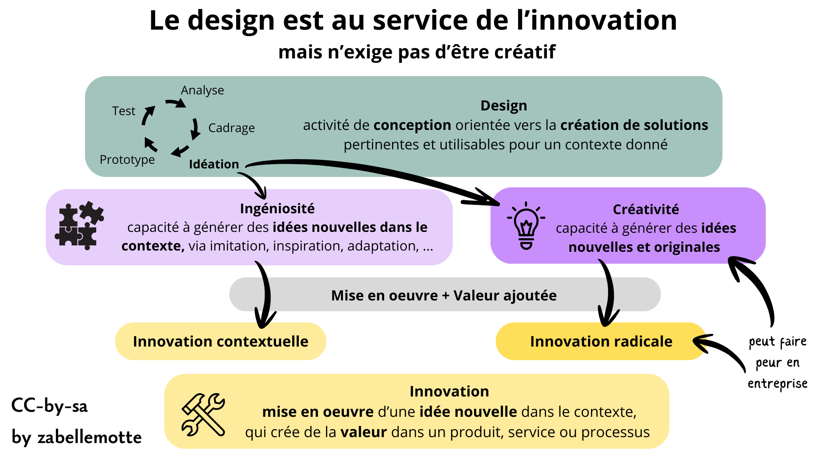

# Cerner les concepts de design et d'innovation
<ul>
<li> <a href="#innovation"> Le design, un processus au service de l'innovation</a> </li>
<li> <a href="#designs"> Un tableau comparatif des différents courants du design </a></li>
<li> <a href="#perso">Ma conception personnelle du design </a> </li>
</ul>

<h4 id="innovation"> Le design, un processus au service de l'innovation</h4>

Le <b>design</b> est une activité de <b> conception</b> orientée ves la <b>création de solutions</b> pertinentes et utilisables dans un contexte donné. 
La conception est envisagée au travers d'un processus itératif qui intègre des phases suivantes : empathie, définition, idéation, prototype et test.
Une belle illustration de l'intérêt de l'approche design avec l'importance du prototypage : 
<a href="https://www.youtube.com/playlist?list=PLSxO7l4kSVIjpY5mY9Py44pJOl9w93M5P" target="_blank">l'extrait du film The Founder qui explique comme le concept de fast food a été inventé par les frères Mac Donalds</a>.

La <b>créativité</b> est la capacité à générer des <b>idées nouvelles et originales</b>. Elle n'est pas forcément au coeur du design 
car la phase d'idéation du design peut seulement reposer sur de l'<b>ingéniosité</b>, la capacité à générer des idées nouvelles dans le contexte, via imitation, inspiration, adaptation, ... 

 Le design peut servir l'<b>innovation</b> lorsque la mise en oeuvre des idées nouvelles apporte une <b>valeur ajoutée</b> au produit, service ou processus. 
Pour innover, il est nécessaire de bénéficier d'un espace de <b> liberté</b>, mais aussi d'un <b>cadre</b> et d'une idée attrayante.

Notons que l'innovation radicale, basée sur une démarche créative, peut faire peur aux entreprises.

A l'issue de l'étape de cadrage du design, il devrait être possible de définir le besoin en complétant cette phrase: 

En tant que ...................,   j'ai besoin de ..................  car mon problème est de ...................

<h4 id="designs"> Un tableau comparatif des différents courants du design </h4>

Le design se décline en plusieurs courants, émanant de différentes disciplines, qui donnent tous une place plus ou moins grande aux utilisateurs. 
En tant qu'universitaire, il m'a semblé intéressant de questionner la place accordée à la veille dans la littérature scientifique. 
Le tableau ci-dessous a été réalisé avec l'aide ChatGPT pour tenter de cerner les nuances entre les différentes écoles du design.

| Paradigme | Postulat central | Point de départ | Savoir mobilisé | Rapport à la littérature scientifique | Contextes pertinents | En savoir plus |
|----------|------------------|-----------------|-----------------|------------------------|----------------------|----------------------|
| Design Thinking | Le problème doit être exploré avant d’être formulé | Empathie, terrain, idéation | Qualitatif, créatif | Faible à modéré, souvent implicite | Innovation, problèmes ouverts | <a href="https://www.interaction-design.org/literature/topics/design-thinking" target="_blank">Article de l'Interaction Design Foundation</a> |
| User-Centered Design (UCD) | Le système doit être adapté aux utilisateurs | Analyse des besoins et des usages | Ergonomie, données utilisateurs | Modéré, structuré | Conception logicielle, IHM | <a href="https://uxmag.com/articles/the-art-science-of-evidence-based-design" target="_blank">Article de l'UXMag</a> |
| Evidence-Based Design | Les décisions doivent reposer sur des preuves | Littérature scientifique, données validées | Scientifique, empirique | Central et explicite | Santé, éducation, systèmes critiques |<a href="https://www.interaction-design.org/literature/topics/user-centered-design" target="_blank">Article de l'Interaction Design Foundation</a> |
| Lean Design | Il faut apprendre vite par l’expérimentation | Hypothèses, Minimum Viable Product, feedback | Expérimental, itératif | Opportuniste, en continu | Produits numériques, équipes agiles | <a href="https://www.interaction-design.org/literature/topics/lean-ux" target="_blank">Article de l'Interaction Design Foundation</a> |
| Participatory Design | Les utilisateurs sont co-concepteurs | Ateliers, co-design | Expérientiel, collectif | Variable | Services publics, contextes sociaux | <a href="https://en.wikipedia.org/wiki/Participatory_design" target="_blank">Article Wikipédia</a> |
| Research-Based Design | La recherche structure la conception | Veille, études, cadres théoriques | Académique et appliqué | Forte, en amont | Innovation informée, systèmes complexes | <a href="https://en.wikipedia.org/wiki/Research-based_design" target="_blank">Article Wikipédia</a> |
| Human-Centered Design (HCD) | Le design doit servir le bien-être humain | Besoins humains, contexte | Interdisciplinaire | Variable | Design social, services, numérique | <a href="https://www.interaction-design.org/literature/topics/human-centered-design" target="_blank">Article de l'Interaction Design Foundation</a>  |
| Service Design | Le service est une expérience globale | Parcours, interactions, acteurs | Systémique, organisationnel | Modéré | Services numériques, publics | <a href="https://www.interaction-design.org/literature/topics/service-design" target="_blank">Article de l'Interaction Design Foundation</a> |
| Value-Sensitive Design | Les valeurs doivent être intégrées au design | Valeurs, enjeux éthiques | Normatif et analytique | Forte, conceptuelle | Numérique responsable, IA | <a href="https://en.wikipedia.org/wiki/Value_sensitive_design" target="_blank">Article Wikipédia</a> |

<h4 id="perso"> Ma conception personnelle du design </h4>

Personnellement, il me semble intéressant de partir des résultats existants dans la littérature scientifique ou de retours d'expériences pour gagner du temps dans la conception. 
Les approches Evidence-Based et Research-Based me parlent beaucoup.

 Mais je ne tomberais pas dans le travers de réserver le design à des experts sans impliquer les utilisateurs. 
Je pense que l'implication des utilisateurs est essentielle pour analyser finement le problème, les besoins et imaginer des solutions. Le processus de design me semble aussi
contribuer à l'accompagnement du changement. Cependant, je suis convaincue que les phases d'idéation peuvent être rendues plus efficientes quand elles sont nourries
par des lectures de références liées.

 Je suis aussi sensible à l'approche Lean qui vise à produire le "Minimum Viable Product". 
L'idée d'optimiser les resources, de prioriser les besoins pour aller à l'essentiel, est aussi au coeur de ma pratique.

 Les articles rédigés dans ce site sont clairement influencés par mon positionnement personnel par rapport au concept de design.
