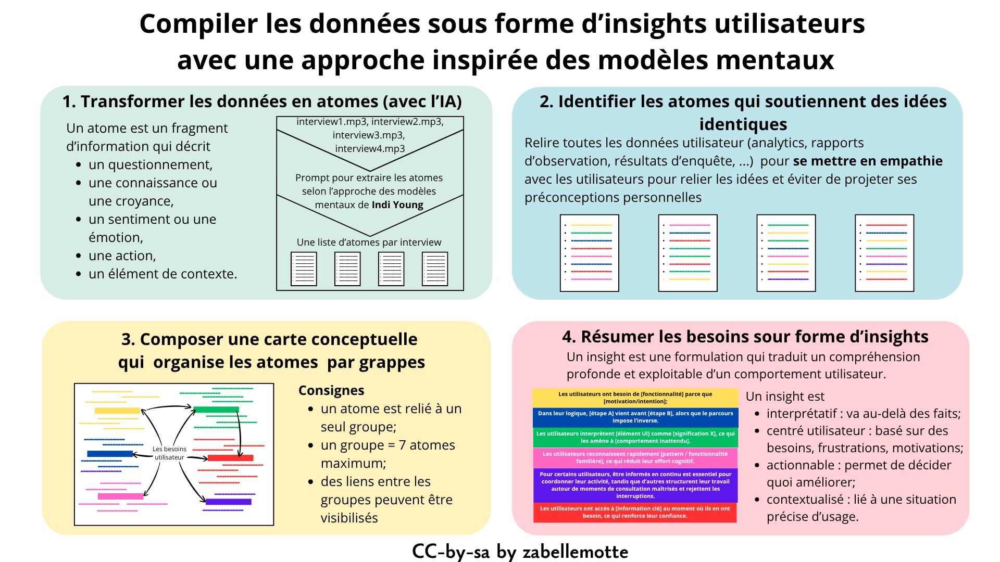

# Compiler les données sous forme d'insights utilisateurs avec une approche inspirée des modèles mentaux

<h4 id="survol">En un coup d'oeil </h4>

    

      
    

    

        <dl class="zab-method-dl">
            <dt>Etape UX</dt>
            <dd>3. Idéation</dd>
            <dt>Catégorie</dt>
            <dd>UX Design</dd>
            <dt>Intérêt</dt>
            <dd>Analyser les données en évitant de projeter son propre modèle mental</dd>
            <dt>Complexité</dt>
            <dd>Difficile</dd>
            <dt>Durée</dt>
            <dd>Quelques jours</dd>
            <dt>En vidéo</dt>
            <dd><a href="https://www.youtube.com/watch?v=TSs0iB6gxV4" target="_blank">A Practical Type of Empathy - Indi Young Keynote (O'Reilly)</a></dd>
        </dl>
    

  

<ul>
<li> <a href="#resume"> En résumé </a></li>
<li> <a href="#atomes">Transformer les données en atomes à l'aide de l'IA</a> </li>
<li> <a href="#carte">Relier les atomes pour composer une carte mentale qui résume les besoins (sans IA !)</a> </li>
<li> <a href="#insights">Résumer les besoins sous forme d'insights</a> </li>
<li> <a href="#personas">Gérer des points de vue différents</a> </li>
<li> <a href="#histoire">La petite histoire</a> </li>
</ul>

<h4 id="resume"> En résumé</h4>
Lors de la phase d'exploration, des interviews ont été menées pour permette de se rapprocher d'une bonne compréhension du besoin des utilisateurs.
Il faut à présent compiler les données issues des interviews pour produire une synthèse exploitable avec les parties prenantes. 
Trier et regrouper des données n'est pas une tâche anodine puisque 
dans la manière de sélectionner et de relier les données, nous opérons des choix. 
L'enjeu essentiel dans l'exercice est d'<b>éviter de projeter ses préconceptions</b>
et de travailler de manière neutre. L'analyse est réalisée en décomposant 
chaque source d'information sur les besoins utilisateurs en fragments d'information : les atomes.
Les atomes sont ensuite rapprochés, reliés, regroupés en veillant à préserver la manière dont les utilisateurs ont exprimé leurs besoins.
Ce travail d'analyse minutieux est finalement résumé sous la forme d'<b>insights utilisateur</b> qui incarnent les <b>idées essentielles exprimées</b>, 
dans un format adapté à une communication au demandeur.

<h4 id="atomes"> Transformer les données en atomes à l'aide de l'IA</h4>

L'exercice peut sembler lourd, mais la décomposition en atomes est une phase clé du processus qui peut être soutenue par l'IA.

Un <b>atome</b> est un fragment d'information utilisateur qui décrit un des éléments suivants :
<b><ul> 
<li>un questionnement, </li>
<li>une connaissance ou une croyance,</li>
<li>un sentiment ou une émotion,</li>
<li>un but ou une motivation,</li>
<li>une action,</li>
<li>un élement de contexte.</li>
</ul></b>

Les interviews enregistrées peuvent facilement être transcrites et décomposées en atomes avec les outils d'IA générative. 
Les fichiers audio des interviews peuvent soumis à un outil d'IA générative et transformés en atomes avec le prompt suivant:

Tu es un expert en UX Research. 
Voici le contexte de mon projet : {CONTEXTE} 
Je vais te donner les notes des interviews que j’ai réalisées ainsi que le guide d’entretien que j’ai utilisé. 
Je veux suivre la méthode d’analyse Mental Models de Indi Young.
Dans un premier temps, tu vas transformer les phrases de mes notes en atomes, en respectant la formule de rédaction “verbe à l’infinitif + complément”
Certains verbes sont interdits : “Considérer, Gérer, S’occuper de, Trouver, Avoir, Laisser, Planifier, Lire, Vouloir, Essayer de, Apprendre que”.
Je veux le résultat sous la forme d’un tableau : première colonne les notes d’entretiens, deuxième colonne l’identifiant de l’interviewé et troisième colonne l’atome.
Un même atome peut être réutilisé plusieurs fois dans une interview et entre les interviewés, il faut garder les atomes distincts pour garder le contexte de l’interviewé.
Attention à ne pas perdre de l’information, il ne faut pas inférer ni deviner.
Avant de répondre, pose-moi des questions pour comprendre mes attentes et demande-moi les informations nécessaires.
Explique ton raisonnement étape par étape.
Puis rédige le tableau.

Quand tout est OK (uniquement !), demandez : “Donne moi des tableaux avec uniquement les atomes. Autant de tableau que d'interviewés”.

<h4 id="carte"> Relier les atomes pour composer une carte conceptuelle qui résume les besoins (sans IA!)</h4

 La phase de recoupement ne peut pas (encore) être supportée par les IA génératives car celles-ci ont tendances à trop simplifier les idées, alors
qu'on souhaite précisément rester fidèle à l'expression des utilisateurs. Une approche pas trop lourde pour réussir le regroupement des idées 
est de suivre les étapes suivantes :
<ul> 
<li> identifier les atomes qui soutiennent des <b>idées identiques</b> (verbes proches, compléments analogues, finalité commune, ...); </li>
<li> relire toutes les autres sources d'analyse des besoins utilisateurs pour <b>se mettre dans la peau des utilisateurs</b>;</li>
<li> <b>relier les atomes sous forme de grappes qui soutiennent la même idée</b>, en veillant à s'inspirer des logiques utilisateurs 
et non de ses propres logiques;  
consignes essentielles pour cette phase :
<ul>
<li>
 un atome ne peut être utilisé qu'une seule fois dans l'ensemble des groupes;</li>
<li>chaque groupe ne peut contenir que <b>7 atomes au maximum</b>;</li>
<li> des liens entre les groupes peuvent être visibilisés;</li>
</ul>
</li>
<li> composer une <b>carte conceptuelle de synthèse</b> qui résume les besoins utilisateurs. </li>
</ul>

Les fans de Miro seront heureux d'exploiter la possibilité de copier leur atomes depuis un fichier tableur pour les coller dans Miro sous forme 
de post-its à trier et relier. 
Mais, pour ma part, je préfère faire ce travail d'analyse sur papier avec ma boîte de crayons de couleurs pour associer les idées proches.

<h4 id="insights"> Résumer les besoins sous forme d'insights</h4>

Pour communiquer vers le demandeur, chaque cluster peut être synthétiser sous la forme d'un <b>insight</b>, 
c'est-à-dire une formulation qui traduit un compréhension profonde et exploitable d’un comportement utilisateur, 
qui permet de prendre de meilleures décisions de conception.

Les caractéristiques d'un insight sont les suivantes :
<ul>
<li><b>interprétatif</b> : il va au-delà des faits; </li>
<li><b>centré utilisateur</b> : il est basé sur des besoins, frustrations, motivations;</li>
<li><b>actionnable</b> : il permet de décider quoi améliorer; </li>
<li><b>contextualisé</b> : il est lié à une situation précise d’usage.</li>
</ul>

Quelques exemples de formulation d'insights:
<ul>
  <li>Les utilisateurs ont besoin de [fonctionnalité] parce que [motivation/intention];</li> 
  <li>Les utilisateurs pensent que [X fonctionne ainsi], alors que le système fonctionne autrement, ce qui crée [confusion / erreur].</li>
  <li>Pour les utilisateurs, la tâche consiste à [objectif réel], alors que l’interface les oblige à [logique différente].</li>
  <li>Les utilisateurs ont accès à [information clé] au moment où ils en ont besoin, ce qui renforce leur confiance.</li>
  <li>Les utilisateurs regroupent mentalement [éléments A et B], mais l’interface les sépare, ce qui perturbe leur progression.</li>
  <li>Les utilisateurs cherchent d’abord à [intention prioritaire], mais l’interface met en avant [autre chose].</li>
  <li>Les utilisateurs s’attendent à pouvoir [action naturelle], et trouvent immédiatement comment le faire.</li>
  <li>Dans leur logique, [étape A] vient avant [étape B], alors que le parcours impose l’inverse.</li>
  <li>Les utilisateurs anticipent facilement les prochaines étapes grâce à [indice / structure claire].</li>
  <li>Les utilisateurs reconnaissent rapidement [pattern / fonctionnalité familière], ce qui réduit leur effort cognitif.</li>
  <li>Les utilisateurs ont besoin de comprendre [information clé] avant de [agir], mais cette information n’est pas disponible au bon moment.</li>
  <li>Les utilisateurs interprètent [élément UI] comme [signification X], ce qui les amène à [comportement inattendu].</li>
</ul>

<h4 id="personas"> Gérer des points de vue différents</h4>

L'analyse des besoins peut révéler des points de vue différents sur certaines fonctionnalités. Comment formuler les insights dans ce cas ? 
L'idée est alors de traduire les différents points de vue dans l'insight en veillent à expliciter la motivation des différents
points de vue.

Par exemple, si les attentes des utilisateurs par rapport aux notifications ne fait pas consensus, on veillera à l'exprimer sous une forme de ce genre: 
<i>“Pour certains utilisateurs, être informés en continu est essentiel pour coordonner leur activité, 
tandis que d’autres structurent leur travail autour de moments de consultation maîtrisés et rejettent les interruptions.”</i>

 Ce type d'insight nous conduira à construire des personas ou experiences maps différents, comme décrit dans l'article
<a href="synthetiser-l-experience-utilisateur-avec-les-personas-et-l-experience-map-chronologique.html"> Synthétiser l'expérience utilisateur avec des personas et l'experience map chronologie </a>

<h4 id="histoire"> La petite histoire </h4>

La méthode proposée s'inspire de la théorie des modèles mentaux de Indi Young décrite dans son livre
<a href="https://s3.amazonaws.com/arena-attachments/2239380/4a0b0ad771cc9c08d36444ff66f12216.pdf?1527654024" target="_blank"> Mental models </a> 
et cette approche d'analyse s'inspire des méthodes d'analyse qualitative exploitées en psychologie cognitive ou en ethnographie.

<h6> Cet article et ses illustrations sont partagées sous licence <a href="https://creativecommons.org/licenses/by-sa/4.0/deed.fr" target="_blank">Creative Commons-by-sa</a>. </h6> 