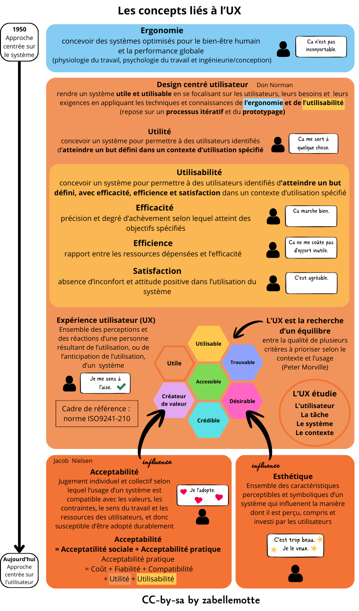

# Découvrir les concepts liés à l'UX

<h4> En un coup d'oeil </h4>

<ul>
<li> <a href="#ergonomie"> Au commencement, l'ergonomie </a></li>
<li> <a href="#conception">Premiers pas ver l'UX avec le design centré utilisateur</a> </li>
<li> <a href="#utilisabilite">Deux concepts au coeur de l'UX : l'utilité et l'utilisabilité</a> </li>
<li> <a href="#ux">Quand le concept s'élagit pour devenir l'expérience utilisateur ...</a> </li>
<li> <a href="#morville">Une analyse selon des critères à prioriser (selon Peter Morville)</a> </li>
<li> <a href="#autres">Deux concepts liés à l'UX : l'acceptabilité et l'esthétique</a> </li>
</ul>
<h4 id="ergonomie"> Au commencement : l'ergonomie</h4>

Dans les années 50, face aux nombreus accidents et erreurs humaines dans la manipulation de machines (notamment le pilotage des avions pendant la seconde guerre mondiale)
le concept d'ergonomie est formalisé.

<b>L'ergonomie</b> vise à concevoir des systèmes optimisés pour le bien-être humain et la performance globale.

Il s'agit alors d'adapter la machine à l'humain. 

<h4 id="conception"> Premier pas vers l'UX avec le design centré utilisateur</h4>

C'est Don Norman qui sera le premier à aller plus loin en proposant d'envisager  <b>la conception centrée sur l'utilisateur</b>. 
Son idée est de rendre un système utile et utilisable en se focalisant sur les utilisateurs, leurs besoins et leurs exigences en appliquant les techniques et connaissances de l'ergonomie
et de l'utilisabilité. L'approche repose sur un processus itératif et du prototypage.

<h4 id="utilisabilite"> Deux concepts au coeur de l'UX : l'utilité et l'utilisabilité</h4>

Pour définir l'utilisabilité, il est d'abord nécessaire de comprendre l'utilité. 

<b>L'utilité</b> vise à concevoir un système pour permettre à des utilisteurs identifiés d'atteindre un but défini dans un contexte d'utilisation spécifié. 

<b>L'utilisabilité</b> va plus loin puisqu'elle vise à concevoir un système pour permettre à des utilisateurs identifiés d'atteindre un but défini, 
avec efficicacité, efficience et satisfaction dans un contexte défini:
<ul>
<li><b>l'efficacité</b> est la précision et le degré d'achèvement selon lequel l'utilisateur atteint des objectifs spécifiés,</li>
<li><b>l'efficience</b> est le rapport entre les ressources dépensées et l'efficacité,</li>
<li><b> la satisfaction</b> est l'absence d'inconfort et l'attitude positive de l'utilisateur dans l'utilisation du système.</li>
</ul>

<h4 id="ux"> Quand le concept s'élagit pour devenir l'expérience utilisateur ...</h4>

 Aujourd'hui, tous ces concepts font partie de la définition plus large d'<b>expérience utilisateur</b> : 
l'expérience utilisateur est l'ensemble des perceptions et réactions d'une personne résultats de l'utilisation, ou de l'anticipation d'utilisation, d'un système. 
Elle est formalisée au travers de <a href="https://www.iso.org/standard/77520.html" target="_blank"> la norme ISO9241-210</a>.

<h4 id="morville"> Une analyse selon des critères à prioriser (selon Peter Morville)</h4>

Peter Morville nous enseigne que l'UX est la <b>recherche d'un équilibre entre la qualité de plusieurs critères à prioriser selon le contexte et l'usage</b>:
utile, utilisable, trouvable, désirable, crédible, accessible et créateur de sens.

<h4 id="autres"> Deux concepts liés à l'UX : l'acceptabilité et l'esthétique</h4>

L'UX est influencée par d'autres éléments qui ne sont pas intégrés à sa définition.

<b>L'acceptabilité</b> est un jugement individuel et collectif selon lequel l'usage d'un système est compatible avec les valeurs, les contraintes, le sens du travail
et les ressources des utilisateurs, et donc susceptible d'être adopté durablement. Les enjeux éthiques, par exemple, conduisent parfois les utilisateurs à refuser
des produits car ils ne sont pas acceptables socialement. Ils peuvent par contre avoir une bonne acceptabilité pratique 
(utilité, utilisabilité, coût, fiabilité et compatibilité). 

<b>L'esthétique</b> est une ensemble de caractéristiques perceptibles et symboliques d'un système qui influencent la manière dont il est perçu, compris et investi par les utilisateurs. 
L'esthétique a aussi une influence sur l'UX puisqu'elle impacte directement le caractère désirable du produit.