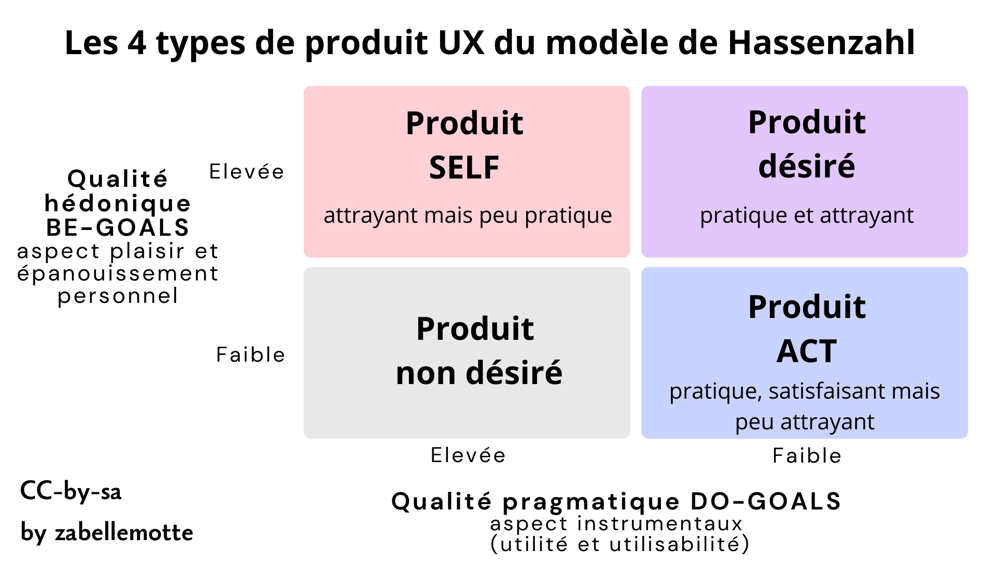

# Découvrir les modèles pour analyser l'UX
<ul>
<li> <a href="#attitude"> L'attitude essentielle pour le UX design : l'empathie</a> </li>
<li> <a href="#hassen"> Deux perspectives pour l'UX dans le modèle de Hassenzhal et 4 types de produits </a></li>
<li> <a href="#mahlke">Une vue intégrée du processus complet de l'ux avec le modèle de Mahlke </a> </li>
<li> <a href="#emotions"> Les modèles pour cartographier les émotions</a> </li>
<li> <a href="#besoins">Les besoins psychologiques selon Hassenzhal</a> </li>
<li> <a href="#temps"> La dynamique temporelle de l'ux selon livre blanc de l'UX</a> </li>
<li> <a href="#eval">L'évaluation de l'UX : plusieurs approches dont les grilles UEQ</a> </li>
</ul>

<h4 id="attitude"> L'attitude essentielle pour le UX design : l'empathie</h4>

Que ce soit pour évaluer ou pour concevoir un produit, l'attitude essentielle à travailler est <b>l'empathie</b> pour être en mesure de cerner les besoins des utilisateurs.
Dans la version anglaise du processus d'analyse de l'UX, la première étape d'ailleurs souvent désignée par le terme "Empathise".
Mais le terme "Empathiser" n'est pas très courant en français ...

<h4 id="hassen"> Deux perspectives pour l'UX dans le modèle de Hassenzhal et 4 types de produits </h4>

Le modèle d'Hassenzhal est décrit en détail dans l'article 
<a href="https://uxmind.eu/2014/11/03/modele-ux-hassenzahl/" target="_blank">Le modèle de l’UX d’Hassenzahl de Catherine Lallemand sur le site uxmind.eu</a>.
Ce modèle amène à envisager l'UX selon deux angles distincts : celui du concepteur qui contruit un produit et celui de l'utilisateur qui l'utilise dans une situation donnée.

Les deux vues se croisent autour des caractéristiques du produit qui sont visées par le concepteur et vécues par l'utilisateur. Hassenzahl décompose l'analyse de ces caractéristiques en deux composantes:
<ul> 
<li>la <b>qualité pragmatique</b> : désigne les aspects instumentaux du produit (son utilité et son utilisabilité) et qui soutiennent la réalisation de tâches, 
les <b>DO-GOALS)</b>;</li> 
<li><b>la qualite hédonique</b> : se réfère au soi, se base sur un jugement potentiel du produit à procurer du plaisir et à satisfaire l'épanouissement de besoins 
humains plus profonds, les <b> BE-GOALS</b>.  </li>
</ul>

Ces axes d'analyse peuvent être croisés pour présenter 4 types de produits selon le niveau, faible ou élevé, de leur qualité pragmatique et hédonique.

Les différents types de produits sont désignés comme suit:
<ul>
<li><b>Produit non désiré</b> : avec une qualité pragmatique et une qualité hédonique faible, ces produits rencontrent peu de succès car il ne sont ni pratiques, ni attrayants;</li>
<li><b>Produit ACT</b> : ils sont pratiques (qualité pragmatique élevée) mais ne sont pas particulièrement attrayants (qualité hédonique faible);</li>
<li><b>Produit SELF</b>: ils sont attrayants mais pas pratiques (qualité hédonique faible et qualité pragmatique élevée);</li> 
<li><b>Produit désiré</b> : ils sont à la fois attrayants et pratiques, c'est l'idéal à atteindre, avec une qualité pragmatique et hédonique élevées.</li> 
</ul>
Cette grille d'analyse sera intéressante pour positionner un produit existant et envisager les pistes d'évolution possibles.

<h4 id="mahlke"> Une vue intégrée du processus complet de l'ux avec le modèle de Mahlke </h4>

Le modèle intégré le plus complet de l'UX est celui de Mahlke qui présente l'UX comme un flux d'élements qui se transforment :

L'analyse de départ porte sur les 3 éléments suivants:
<ul>
<li><b>le système</b> et ses propriétés,</li>
<li><b>l'utilisateur</b> et ses spécificités,</li>
<li><b>le contexte</b> et ses particularités (les tâches).</li>
</ul>

L'interaction humain-machine constitue le rencontre de ces 3 éléments et l'expérience utlisateur est décomposée en 3 parties :
<ul>
<li><b>la perception des qualités instrumentales </b> (semblable aux qualités pragmatiques de Hassenzhal),</li>
<li><b>la perception des qualités non instrumentales </b> (semblable aux qualités hédoniques de Hassenzhal mais reliée explictement à l'esthétique et à la symbôlique),</li>
<li><b>les réactions émotionelles </b> (point non explicité dans le modèle de Hassenzhal).</li>
</ul>
Ces 3 éléments semblent expliquer <b>les conséquences de l'expérience utilisateur : les jugements globaux et les comportements d'usage.</b>

<h4 id="emotions"> Les modèles pour cartographier les émotions </h4>
Plusieurs modèles peuvent permettre de carthographier les émotions, comme la roue des émotions de Plutchik ou le roue des émotions de Genève.
Ces deux outils sont présentés en détail dans l'article <a href="https://blog.sbw.be/scips/2025/typologie-des-emotions-i18n/454/" target="_blank"> 
"Typologie des émotions – i18n" du blog de Sébastien Barbieri</a>.

<h4 id="besoins"> Les besoins psychologiques selon Hassenzhal </h4>
Pour analyser les qualités hédoniques des produits, Hassezhal nous propose aussi une grille (plus détaillée que celle de Maslow) des besoins psychologiques:
<ul>
<li><b>la réalisation de soi, de sens</b> :  sont liées au développement de son meilleur potentiel, en alignement avec ses valeurs;</li>
<li><b>l'autonomie, l'indépendance</b>:  sont liées au besoin d'être la cause de ses propres actions et d'être en mesure de personnaliser son enironnement;</li>
<li><b>l'appartenance, le relationel</b> :  reposent sur le fait d'avoir des contacts réguliers et proches avec les personnes qui comptent;</li>
<li><b>l'influence, la popularité</b> : supposent de se sentier aimé, respecté et d'avoir un impact sur ce que les gens font;</li>
<li><b>la compétence, l'efficacité</b> : reposent sur le fait d'atteindre ses buts et d'accompalir ses tâches;</li>
<li><b>la sécurité et le contrôle</b> : s'appuient sur le sentiment que la vie est structurée et prévisible et qu'il est important d'interagir avec des systèmes prévisibles;</li>
<li><b>le plaisir et la stimulation</b> : sont basées sur le fait de ressentir du plaisir, de réaliser une activité nouelle ou ludique;</li>
<li><b>le bien-être et la santé</b> : reposent sur le fait de se senti bien mentalement et physiquement (composante ajoutée au modèle original de Hassenzhal).</li>
</ul>
Lors de la conception de persona, nous verrons qu'il est essentiel d'identifier les besoins en jeu et les UX cards seront un bel outil à exploiter pour ce faire.

<h4 id="temps"> La dynamique temporelle de l'ux selon livre blanc de l'UX </h4>
Les deux modèles précédent permettent de cerner les composantes de l'expérience utilisateur et de dégager 4 types de produits, mais ils ne présentent pas la composante temporelle de l'expérience utlisateur.
Le livre blanc sur l'UX décompose plusieurs phases temporelles de l'UX :
<ul>
<li><b>l'UX anticipée</b> : basée sur l'expérience imaginée avant usage,</li>
<li><b> l'ux momentannée</b> : basée sur l'expérience vécue pendant l'usage,</li>
<li><b> l'ux épisodique</b> : basée sur ce qu'on retient de l'expérience après usage (les détails s'atténuent),</li>
<li><b> l'ux cumulative</b> : basée sur ce que l'on retient après de multiples utilisations à travers le temps.</li>
</ul>
Les méthodes d'évaluation à exploiter seront différentes selon la temporalité d'usage.

<h4 id="eval"> L'évaluation de l'UX : plusieurs approches dont les grilles UEQ</h4>

Pour évaluer l'UX, <b>les tests utilisateurs</b> et les questionnaires d'échelle UX peuvent être utilisés pour évaluer tant les qualités pragmatiques que les qualités hédoniques.
Les <b>User Experience Questionnaire</b> sont documentés en ligne sur les sites 
<ul>
<li><a href="https://www.ueq-online.org/" target="_blank">https://www.ueq-online.org</a> (pour la version simple), </li>
<li><a href="https://ueqplus.ueq-research.org/" target="_blank">https://ueqplus.ueq-research.org</a> (pour la version plus longue, avec des items qui se recoupent). </li>
</ul>
Les tests utilisateurs sont devenus l'approche la plus simple pour évaluer l'UX car les outils de prototypage permetttent de réaliser un prototype de plus en plus rapidement.

Pour évaluer les qualités pragmatiques, il est aussi possible d'exploiter:
<ul>
<li><b>les évaluations expertes</b>,</li>
<li><b>les checklists d'utilisabilité</b>.</li>
</ul>

Pour évaluer les qualités hédoniques, il est aussi possible d'exploiter:
<ul>
<li><b>les analyses des émotions</b>,</li>
<li><b>les analyses des besoins</b>.</li>
</ul>

