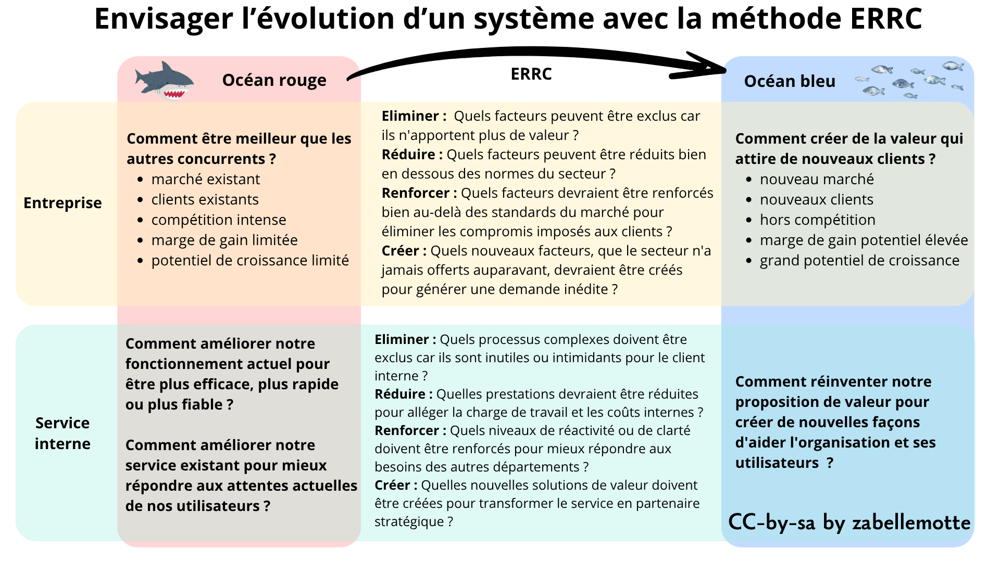

# Envisager l'évolution d'un système avec la méthode ERRC
<h4 id="survol">En un coup d'oeil </h4>

    

      
    

    

        <dl class="zab-method-dl">
            <dt>Etape UX</dt>
            <dd>3. Idéation</dd>
            <dt>Catégorie</dt>
            <dd>Stratégie d'entreprise</dd>
            <dt>Intérêt</dt>
            <dd>Envisager l'évolution d'un outil ou d'un service de manière élargie</dd>
            <dt>Complexité</dt>
            <dd>Simple</dd>
            <dt>Durée</dt>
            <dd>Quelques jours</dd>
            <dt>En vidéo</dt>
            <dd><a href="https://www.youtube.com/watch?v=j-b7MHabLPg" target="_blank"> Blue Ocean Strategy (With Real World Examples)  (Business School 101)</a></dd>
        </dl>
    

  

<ul>
<li> <a href="#article">Blue Ocean Strategy: From Therory to Practice</a></li>
<li> <a href="#part1">Distinction entre Océans Rouges et Océans Bleu</a> </li>
<li> <a href="#part2">Le concept d'Innovation de Valeur</a> </li>
<li> <a href="#part3">L'outil de diagnostic : le Canevas Stratégique</a> </li>
<li> <a href="#part4">L'intérêt de l'analyse ERRC</a> </li>
<li> <a href="#part5">Impact sur la croissance et la rentabilité</a> </li>
<li> <a href="#part6"> L'intérêt de la méthode pour un client interne</a></li>
<li> <a href="#part7">Sortir de l'Océan Rouge interne</a> </li>
<li> <a href="#part8">Passer de l'Inside-Out à l'Outside-In</a> </li>
<li> <a href="#part9">Simplification via l'analyse ERRC interne</a> </li>
<li> <a href="#part10">Alignement du système pour l'efficacité interne</a> </li>
<li> <a href="#part11">Pérennité et influence stratégique</a> </li>
</ul>

<h3 id="article">Blue Ocean Strategy: From Therory to Practice</h3>

Cet article dresse un résumé de la référence suivante décrivant <b>la stratégie de l'océan bleu pour soutenir l'évolution d'un produit ou d'un service </b>:

<cite>Chan Kim,W. (2025). Blue Ocean Stragegy: From Theory to Practice. California Review Management, Vol 47, N°3, 105–121.  
<a href="https://cmr.berkeley.edu/2005/05/47-3-blue-ocean-strategy-from-theory-to-practice/" target="_blank">https://cmr.berkeley.edu/2005/05/47-3-blue-ocean-strategy-from-theory-to-practice/</a></cite>

Ce résumé a été composé avec l'aide de Notebook LM.

<h4 id="part1">Distinction entre Océans Rouges et Océans Bleus</h4>
    
Les <strong>océans rouges</strong> représentent les industries existantes où les frontières sont définies et les règles de concurrence connues. 
    Dans cet espace, les entreprises tentent de surpasser leurs rivaux pour s'accaparer une part du marché existant, ce qui mène souvent à une baisse des profits 
    et à une commoditisation des produits. À l'inverse, les <strong>océans bleus</strong> désignent des espaces de marché inconnus, créés par le développement 
    d'une demande nouvelle, où la concurrence devient hors de propos car les règles du jeu restent à établir.

<h4 id="part2">Le concept d'Innovation de Valeur</h4>
    
L'approche repose sur une <strong>vue reconstructionniste</strong> de la stratégie, s'opposant à la vision traditionnelle où les structures de marché sont 
    considérées comme figées. Au lieu de choisir entre la différenciation et le bas coût, la stratégie océan bleu vise l'<strong>innovation de valeur</strong>. 
    Il s'agit de briser le compromis valeur/coût en augmentant simultanément la valeur pour l'acheteur et en réduisant les coûts pour l'entreprise grâce à un alignement 
    de tout le système d'activités.

<h4 id="part3">L'outil de diagnostic : le Canevas Stratégique</h4>
    
L'outil central de diagnostic est le <strong>canevas stratégique</strong>, qui permet de visualiser le profil stratégique d'une industrie en identifiant les facteurs 
    sur lesquels repose la concurrence. 

    Le <strong>canevas stratégique</strong> est à la fois un outil de diagnostic et un cadre d'action essentiel pour élaborer une stratégie océan bleu. 
    Pour le réaliser, on utilise un graphique où l'<strong>axe horizontal</strong> répertorie les facteurs clés sur lesquels l'industrie se livre concurrence et investit
    (produit, service, livraison), tandis que l'<strong>axe vertical</strong> mesure le niveau d'offre que les acheteurs reçoivent pour chacun de ces facteurs. 
    En reliant ces points, on obtient la <strong>courbe de valeur</strong>, une représentation graphique de la performance relative d'une entreprise par rapport à 
    ses concurrents. La réalisation concrète commence par la cartographie de l'état actuel du marché pour comprendre où les concurrents investissent, 
    ce qui révèle souvent une convergence des profils stratégiques dans un « océan rouge ». Pour transformer ce diagnostic en action, 
    l'entreprise doit ensuite détourner son regard des concurrents pour se concentrer sur les <strong>alternatives et les non-clients</strong>, 
    ce qui permet de redéfinir les éléments de valeur. 
    

   
En analysant les <strong>courbes de valeur</strong>, une entreprise peut constater si elle est enlisée dans un océan rouge 
    ou si elle parvient à s'en détacher. L'objectif est de créer une courbe de valeur qui possède trois caractéristiques essentielles : la <strong>focale</strong>, 
    la <strong>divergence</strong> et un <strong>slogan percutant</strong>.

    

<h4 id="part4">L'intérêt de l'analyse ERRC</h4>

  L'<strong>analyse ERRC</strong> (Eliminer, Réduire, Renforcer, Créer), aussi appelée le "cadre des quatre actions", est l'outil fondamental pour briser le 
  compromis entre la différenciation et le bas coût. Elle permet de reconstruire les éléments de valeur pour l'acheteur en agissant sur quatre leviers stratégiques :
<ul>
<li><strong>Eliminer </strong>:
Cette action consiste à identifier les facteurs sur lesquels l'industrie se livre concurrence depuis longtemps et qui sont souvent considérés comme acquis.
L'objectif est de supprimer les éléments qui n'apportent plus de valeur réelle ou qui peuvent même en soustraire aux yeux du client.
Cela permet de réduire immédiatement la complexité et la structure de coûts. 
</li>

<li><strong>Réduire </strong>:
On examine ici si certains produits ou services ont été sur-conçus uniquement pour surpasser la concurrence.
L'entreprise identifie les facteurs où elle offre plus que nécessaire, augmentant ses coûts sans gain de valeur significatif pour l'acheteur.
L'idée est de ramener ces niveaux d'offre bien en dessous de la norme de l'industrie pour simplifier l'activité.
</li>

<li><strong>Renforcer </strong>:
Cette action pousse à découvrir et à éliminer les compromis que l'industrie force traditionnellement les clients à faire.
Il s'agit d'augmenter le niveau de performance ou de qualité de certains facteurs clés bien au-delà des standards actuels du marché.
L'objectif est d'apporter un gain de valeur immédiat et perceptible sur des éléments cruciaux pour l'expérience client.
</li>

<li><strong>Créer </strong>:
Cette étape consiste à découvrir des sources de valeur entièrement nouvelles que l'industrie n'a jamais offertes auparavant.
L'entreprise regarde au-delà des frontières habituelles pour attirer les <strong>non-clients</strong> en créant une demande nouvelle.
C'est cette action qui permet de rendre la concurrence hors de propos en modifiant les bases mêmes de l'offre.
</li>
</ul>

Cette grille est un outil d'action qui force l'entreprise non seulement à se poser les quatre questions, mais surtout à <strong>agir simultanément</strong> 
sur chacun des axes pour dessiner une nouvelle courbe de valeur. 

  En remplissant cette grille, l'entreprise obtient deux bénéfices immédiats : les actions d'<strong>exclusion</strong> et de <strong>réduction</strong> font chuter 
  sa structure de coûts, tandis que les actions de <strong>renforcement</strong> et de <strong>création</strong> augmentent la valeur pour l'acheteur. 
  C'est cet alignement global qui permet d'atteindre l'<strong>innovation de valeur</strong> et de sortir durablement de l'océan rouge.

<h4 id="part5">Impact sur la croissance et la rentabilité</h4>
    
L'intérêt majeur pour l'entreprise est la <strong>croissance rentable</strong>. Les recherches des auteurs montrent que si les lancements dans les océans rouges 
    représentent 86 % des initiatives, ils ne génèrent que 39 % des profits. En revanche, les 14 % d'investissements consacrés aux océans bleus génèrent <strong>61 % 
    des profits totaux</strong>. En se concentrant sur les <strong>non-clients</strong> et les alternatives plutôt que sur les concurrents directs, l'entreprise ouvre un 
    espace de marché vierge qui garantit une performance supérieure.

<h3 id="part6">L'intérêt de la méthode pour un client interne</h3>

<h4 id="part7">Sortir de l'Océan Rouge interne</h4>
    
Travailler pour un client interne revient souvent à naviguer dans un <strong>océan rouge interne</strong> où le département est perçu comme un simple 
    centre de coûts comparé à des standards rigides. La méthode permet de redéfinir cette relation en cessant de se comparer aux processus habituels pour créer une valeur 
    unique. L'enjeu est de transformer une fonction support en un partenaire stratégique dont l'apport est devenu "hors concurrence" vis-à-vis d'une externalisation.

<h4 id="part8">Passer de l'Inside-Out à l'Outside-In</h4>
    
La source souligne que le langage utilisé (ex: jargon technique vs termes compréhensibles par l'acheteur) révèle si une vision est <strong>"inside-out"</strong> 
    (opérationnelle) ou <strong>"outside-in"</strong> (orientée demande). Pour un client interne, cela signifie traduire les compétences techniques en 
    bénéfices clairs pour les autres départements. En adoptant cette perspective, on cesse de livrer des services dont le client n'a pas besoin pour se concentrer 
    sur son utilité réelle.

<h4 id="part9">Simplification via l'analyse ERRC interne</h4>
    
L'analyse ERRC devient un outil de <strong>simplification administrative</strong>. Plus précisément, l'analyse ERRC peut se décliner comme suit dans le 
    contexte d'une évolution d'un service interne:
<ul><li>
    <strong>Éliminer :</strong> 
    Le service doit identifier les facteurs que l'organisation considère comme acquis mais qui n'apportent plus de valeur réelle aux autres départements. 
    En interne, cela signifie souvent supprimer le jargon opérationnel et technique complexe. 
    Il s'agit également d'éliminer les processus ou les contrôles hérités du passé qui ralentissent l'activité sans bénéfice concret pour l'utilisateur final.
  </li>
  <li>
    <strong>Réduire :</strong> 
    Cette action consiste à identifier où le service interne "sur-livre" ou propose des solutions trop sophistiquées par rapport aux besoins réels. 
    Par exemple, on peut réduire la complexité des rapports ou limiter la gamme de services proposés pour éviter de paralyser le client interne face à trop de choix. 
    Réduire ces investissements inutiles permet de faire chuter la structure de coûts interne (temps, budget, ressources).
  </li>
  <li>
    <strong>Renforcer :</strong> 
    Le département doit découvrir et éliminer les compromis que les employés ou les autres managers sont forcés de faire. 
    Cela peut signifier relever massivement le niveau de <strong>réactivité</strong>, la clarté des réponses ou la pertinence stratégique bien 
    au-delà des standards habituels de l'entreprise. L'objectif est d'apporter un gain de valeur immédiat sur les points de friction les plus douloureux
    pour le client interne.
  </li>
  <li>
    <strong>Créer :</strong> 
    L'innovation consiste ici à proposer des sources de valeur totalement inédites que le client interne n'avait jamais envisagées. 
    Cela peut passer par la création d'outils d'auto-service intuitifs, de conseils proactifs pour aider les autres départements à atteindre leurs propres objectifs, 
    ou d'une expérience de service simplifiée et "sans intimidation" qui change la perception de la fonction support.
  </li>
</ul>

<h4 id="part10">Alignement du système pour l'efficacité interne</h4>
    
L'innovation de valeur appliquée en interne permet d'aligner l'<strong>utilité, le "prix" (coût interne) et les activités</strong>. 
    En réduisant la complexité des processus, le département interne peut offrir une meilleure expérience au client tout en diminuant sa charge de travail. 
    Cet alignement global rend la solution interne bien plus attractive et durable, évitant les investissements inutiles dans des facteurs qui n'ajoutent qu'une 
    valeur incrémentale.

<h4 id="part11">Pérennité et influence stratégique</h4>
    
Enfin, l'approche permet de définir une mission interne dotée de <strong>focale et de divergence</strong>. 
    Une stratégie interne qui se contente de copier n'a aucune raison de se démarquer et reste vulnérable aux coupes budgétaires. 
    En créant cet "océan bleu interne" avec un <strong>slogan clair</strong> et une offre différenciée, le département garantit son influence 
    et sa pérennité au sein de l'organisation en devenant indispensable à la réussite globale de l'entreprise.

<h6> Cet article et ses illustrations sont partagées sous licence <a href="https://creativecommons.org/licenses/by-sa/4.0/deed.fr" target="_blank">Creative Commons-by-sa</a>. </h6> 