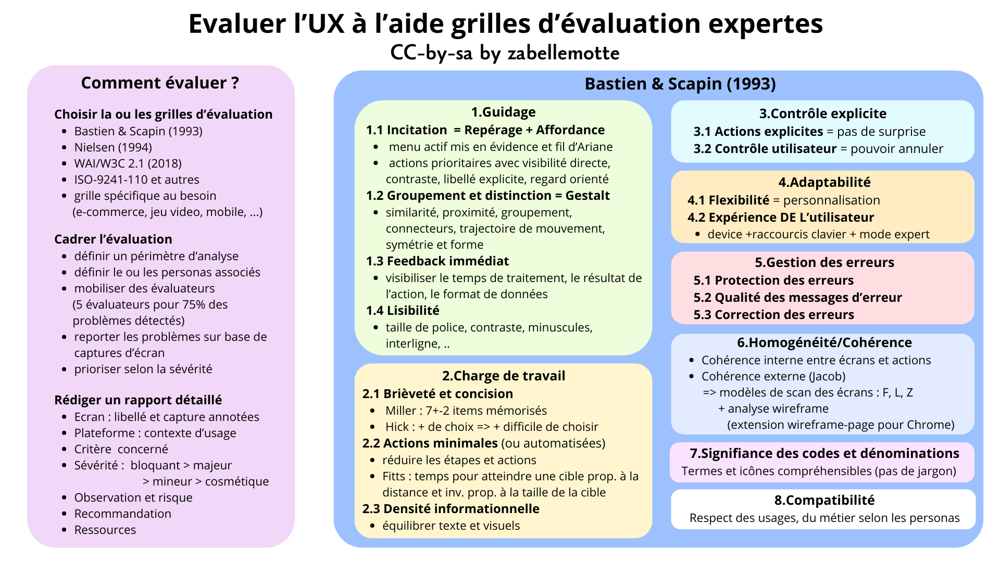

# Evaluer l'UX à l'aide de grilles d'évaluation expertes
<h4 id="survol">En un coup d'oeil </h4>

    

      
    

    

        <dl class="zab-method-dl">
            <dt>Etape UX</dt>
            <dd>5. Evaluation experte</dd>
            <dt>Catégorie</dt>
            <dd>UX Design</dd>
            <dt>Intérêt</dt>
            <dd>Evaluer l'interface en détail</dd>
            <dt>Complexité</dt>
            <dd>Moyenne</dd>
            <dt>Durée</dt>
            <dd>Quelques heures, si possible pour 5 évaluateurs</dd>
            <dt>En vidéo</dt>
            <dd><a href="https://www.youtube.com/watch?v=TSs0iB6gxV4" target="_blank">A Practical Type of Empathy - Indi Young Keynote (O'Reilly)</a></dd>
        </dl>
    

  

<ul>
<li> <a href="#resume"> En résumé </a></li>
<li> <a href="#prepa"> Organiser une évaluation heuristique</a> </li>
<li> <a href="#focus"> Focus sur la grille d'évaluation de Bastin & Scapin</a> </li>
<li> <a href="#autres"> Autres grilles d'évaluation</a> </li>
<li> <a href="#histoire">La petite histoire</a> </li>
</ul>

<h4 id="resume"> En résumé</h4>

Les évaluations heuristiques se basent sur des grilles expertes éprouvées comme 
la <a href="https://usabilis.com/wp-content/uploads/2026/03/Criteres-Ergonomiques-pour-l-Evaluation-d-Interfaces-Utilisateur-Scapin-Bastien.pdf" target="_blank">grille de Bastien&Scapin</a> ou
la <a href="https://www.nngroup.com/articles/ten-usability-heuristics/" target="_blank">grille de Nielsen</a>. L'idéal est d'être en mesure de mobiliser
plusieurs utilisateurs, idéalement 5 experts, pour relever 75% des problèmes d'ergonomie. Elle exige
toutefois un temps de mise en contexte pour les évaluateurs s'ils ne sont pas familiers avec
le métier. L'intérêt l'évaluation heuristique est qu'elle peut coûteuse et permet de compléter 
les tests utilisateurs pour améliorer l'interface.

<h4 id="prepa"> Organiser une évaluation heuristique</h4>

 L'organisation d'une évaluation experte se base sur les <b>étapes</b> suivantes :
<ul> 
<li> le choix d'une ou plusieurs <b>grilles</b> d'évaluation; </li>
<li> la définition de la ou des <b>personas</b> ciblés par l'analyse; </li>  
<li> la définition d'un <b>périmètre</b> d'analyse : l'idée est de se focaliser sur une ou des actions importantes pour la ou les personas;</li>
<li> la mobilisation de 5 évaluateurs (si possible); </li>
<li> l'évaluation individuelle de l'interface, en soulignant des points négatifs et positifs;</li>
<li> une discussion collective sur les différents problèmes relevés;</li>
<li> la définition d'un degré de sévérité pour chaque problème; </li>
<li> la rédaction d'un rapport de synthèse des points d'évolution importants.</li>
</ul>

 
L'analyse est synthétisée dans un <b>rapport</b> qui présente les principaux problèmes 
avec les éléments suivants:
<ul>
<li> un libellé pour l'écran </li>
<li> une <b>capture d'écran</b> annotée;</li>
<li> les informations sur l'environnement de travail si c'est pertinent (mobile, desktop, ...;</li>
<li> le ou les <b>critères</b> en jeu; </li>
<li> la <b>sévérité</b> : 
    <ul><li>bloquant : fréquent et inévitable;</li>
        <li>majeur : fréquent et difficilement évitable;</li>
        <li>mineur : peu fréquent et évitable;</li>
        <li>cosmétique : rare et facilement évitable; </li>
        </ul>
<li> l'observation et les risques;</li>
<li> un ou des <b>recommandations</b>; </li>
<li> des éventuelles ressources associées. </li>
</ul>
Certains outils en ligne (payants) peuvent être utilisés pour soutenir ce type de rapport comme 
<a href="https://capian.co/fr" target="_blank">Capian.co</a> 
ou <a href="https://www.opquast.com/" target="_blank">Opquast.com</a>. 
Si les destinatires du rapport sont plutôt des décideurs, il peut être pertinent de l'organiser
dans une logique de <b>scénarios d'utilisation</b> associés aux personas.

<h4 id="focus"> Focus sur la grille d'évaluation de Bastien & Scapin</h4>

 
La grille heuristique de Bastien & Scapin est simple à appréhender et très connue dans le monde francophone.
Elle est stucturée en <b> 8 parties</b> décrites ci-dessous.
<ol>
<li> 
<b>Guidage</b>
    <ol> <li> <b>Incitation</b> : cette dimension repose sur l'analyse de 2 composantes:
        <ul> 
            <li> les éléments de repérage comme le fait de visibiliser les menus essentiels sur tous les écrans, la visibilisation du menu actif, le fil d'Ariane; 
            </li>
            <li> l'affordance des éléments d'action, avec un contraste élevé pour les actions essentielles, des libellés explicites pour les actions
                  et des formats de données explicités dans les formulaires. 
            </li>
        </ul>
        </li>
        <li> <b>Groupement/ Distinction entre items</b>: cette règle repose essentiellement sur les lois de la Gestalt qui décrivent les approches pour
             grouper des éléments : similarité, proximité, groupement, éléments connectés, trajectoire de mouvement, symétrie et forme.
        </li>
        <li> <b>Feedback immédiat</b> : ce besoin de feedback immédiat concerne toutes les actions et en particulier celles qui prennent du temps, 
             on veillera donc à donner un retour explicite à toute action et à visibiliser l'évolution du chargement;
        </li>
        <li> <b>Lisibilité</b> : les tailles de polices, les contrastes et les interlignes seront soignés pour soutenir la lisibilité et on préférera 
        les polices minuscules et sans sérif pour le texte affiché sur écran;
        </li>
    </ol>
</li>
<li>
<b>Charge de travail</b>
    <ol> <li> <b>Brièveté et concision </b>: la navigation primaire proposera un nombre limité d'items et le travail de lecture sera soutenu par le chuncking des
              éléments quand ça aide;
              <ul> <li> Loi de Miller : notre mémoire a court terme nous permet de retenir 7+-2 éléments. </li>
                <li> Loi de Hick : plus il y a de choix, plus c'est difficile de décider. </li>
            </ul>
        </li>
        <li> <b>Actions minimales</b> : il faut réduire autant que possible le nombre d'étapes et d'actions nécessaires.
             <ul> <li> Loi de Fitts : Le temps pour atteindre une cible est proportionnel à la distance entre le point de départ et la cible et 
                       inversément proportionnel à la taille de la cible.</li> </ul>
        </li>
        <li> <b>Densité informationelle</b> : il faut équilibrer les textes et visuels pour que le message essentiel soit clairement visible. 
             <ul> <li> le test des 5 secondes est une approche qui permet de vérifier si le mesage essentiel d'une page est clair;</li>
             <li> la méthode Corse peut soutenir une démarche de simplification: Cacher, Organiser, Réduire, Standardiser, Eliminer.</li>
             </ul>            
        </li>
    </ol>
</li>
<li>
<b>Contrôle explicite </b>
    <ol> <li> <b>Actions explicites</b> : les actions engendrent des réponses transparentes, sans surprise; le comportement respecte les conventions d'action
         (par exemple sur mobile); </li>
         <li> <b>Contrôle utilisateur </b>: il doit être possible d'annuler une action et de commander les médias (stop, pause, play). </li>
    </ol>
</li>
<li>
<b>Adaptabilité</b>
    <ol> <li> <b>Flexibilité</b> : l'interface doit permettre des personnalisations à l'utilisateur selon ses habitudes et stratégies. </li>
         <li> <b>Expérience de L'utilisateur</b> : des options spécifiques peuvent être proposées, par exemple pour les utilisateurs experts, 
        comme des raccourcis clavier, ou un mode expert.</li>
    </ol>
</li>
<li>
<b>Gestion des erreurs</b>
    <ol> <li> <b>Protection des erreurs</b> : la conception doit faire en sorte de prévenir les erreurs (annulation par exemple);</li>
         <li> <b>Qualité des messages d'erreur</b> : les messages doivent être pertinents, exacts, facile à lire, sans jargon, avec des instructions claires
              sur la résolution; </li>
         <li> <b>Correction des erreurs</b> : la correction doit être possible. </li>
    </ol>
</li>
<li>
<b>Homogénéité/Cohérence</b> : le système doit être prévisible, stable, facile à apprendre au regard des autres écrans et des autres outils.
    <ul> <li> on veillera en particulier à la cohérence de la présentation, de l'ordre et du comportement des boutons d'action;</li>
        <li> la cohérence du vocabulaire utilisé au fil des pages sera aussi soignée; </li> 
        <li> Loi de Jacob : les utilisateurs passent plus de temps ailleurset préfèrent que le site fonctione de la même manière que les autres sites.</li>
        <li> les recherches ont monté que le scan des écrans suivait le plus souvent un modèle en F; depuis les mobiles, le scan en L s'est aussi imposé et 
             le scan des écrans de résultats de recherche a aussi révélé un pattern en Z; il peut être intéressant d'analyser le profil des pages essentielles
             en réalisant une capture foule de l'écran ou en les scannant avec une extension de navigateur qui dégage les wireframes comme
             <a href="https://chromewebstore.google.com/detail/wireframe-page/bhaaofjcbafngjjneehlganleamobkke" target="_blank">
             Wireframe-page pour Chrome</a>.
        </li>
    </ul>
</li>
<li>
<b>Signifiance des codes et dénominations</b> : le vocabulaire, les icônes et les métaphores utilisées pour les libellés et les actions doivent avoir une sémantique forte 
pour la ou les personas du site. </li>
<li> <b>Compatibilité</b> : l'interface et les actions doivent être compatibles avec les usages et le métier des personas.</li>
</ol>

<h4 id="autres"> Autres grilles d'évaluation </h4>

L'article <a href="https://hal.science/hal-01207449/" target="_blank"> Évolution de l’inspection heuristique : vers une
intégration des critères d’accessibilité, de praticité, d’émotion et de persuasion dans l’évaluation ergonomique </a> de E.Brangier & al. 
dresse une analyse des grilles heuristiques pratiquées et montre qu'elles ont subi l'influence de différentes disciplines pour se focaliser
successivement sur l'accessibilité, la praticié, l'émotionalité et la persuasivité. 

 Ma pratique professionnelle m'a amenée à pratiquer d'autres grilles heuristiques :
<ul> <li> <a href="https://www.w3.org/Translations/WCAG21-fr/" target="_blank">les règles d'accessibilité du W3C </a>, qui visent à rendre les contenus
accessibles à tous, sur tous les devices (sans cibler explicitement les personnes handicapées); elles ont le gros avantage d'être composées de critères
mesurables qui permettent par exemple de définir objectivement ce qu'est un contraste élevé pour un titre ou un bouton;</li>
<li> <a href="https://fr.wikipedia.org/wiki/ISO_9241" target="_blank"> la norme ISO 9241</a> est une référence essentielle qui se décline pour
à peu près tous les systèmes d'interaction humain-machine; les déclinaisons 800 abordent même les environnements immersifs; ces documents sont payants
mais il est possible d'y avoir accès via les bibliothèques universitaires; ces références permettent de justifier toutes les étapes de la démarche UX:
<ul> <li> ISO-9241-210 permet de justifier la démarche centrée utilisateur;  </li>
     <li> ISO-9241-143 étudie l'ergonomie des formulaires; </li>
     <li> ISO-9241-115 cible la navigation et évoque notamment l'importance d'organiser l'information selon le modèle mental des utilisateurs; </li>
     <li> et bien d'autres selon vos projets.
</ul>
L'avantage de ce type de norme est le poids qu'elle représentent pour motiver une décision dans une grande entreprise.
</li>
</ul>

 
D'autres grilles me semblent intéressantes à épingler :
<ul>
<li> la <a href="https://www.sciencedirect.com/science/article/abs/pii/S0920548915000926" target="_blank"> grille SMASH </a>
de R.Inostroza&al pour les interfaces mobiles;</li>
<li> la <a href="https://scholar.google.fr/citations?view_op=view_citation&hl=en&user=G0hQweQAAAAJ&citation_for_view=G0hQweQAAAAJ:tS2w5q8j5-wC" target="_blank"> 
  grille dédicacée aux sites de e-commerce </a>
de L.Bonastre&T.Granollers;</li>
<li> la <a href="https://www.researchgate.net/publication/220587882_User_Interface_Design_for_Public_Kiosks_An_Evaluation_of_the_Taiwan_High_Speed_Rail_Ticket_Vending_Machine" target="_blank">
 grille dédicacée aux bornes interactives </a>
de F.E.Sandnes&al.;</li>
<li> et bien d'autres à trouver via un travail de veille scientifique soutenu par un outil d'IA dédicacé comme 
<a href="https://elicit.com/" target="_blank"> Elici.com</a>.
</ul>

<h4 id="histoire"> La petite histoire </h4>

L’évaluation heuristique en UX trouve ses origines dans les travaux de Jakob Nielsen 
et Rolf Molich au début des années 1990. Ces chercheurs ont proposé une méthode d’inspection 
rapide des interfaces basée sur un ensemble de principes généraux d’utilisabilité, appelés 
« heuristiques ». 
L’idée était de permettre à des experts d’identifier efficacement des problèmes d’ergonomie 
sans recourir à des tests utilisateurs lourds. 
Cette approche s’inscrit dans l’évolution plus large de l’Interaction Homme-Machine, 
qui cherchait à structurer des méthodes d’évaluation systématiques et pragmatiques.

