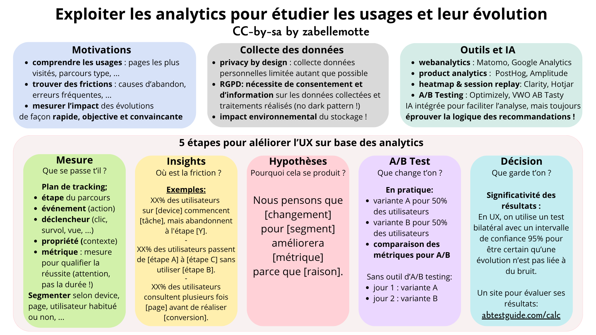

# Exploiter les analytics pour étudier les usages et leur évolution

<h4 id="survol">En un coup d'oeil </h4>

    

      
    

    

        <dl class="zab-method-dl">
            <dt>Etape UX</dt>
            <dd>2. Exploration</dd>
            <dt>Catégorie</dt>
            <dd>UX design</dd>
            <dt>Intérêt</dt>
            <dd>Comprendre les usages, identifier des frictions et objectiver l'impact des changements</dd>
            <dt>Complexité</dt>
            <dd>Moyenne</dd>
            <dt>Durée</dt>
            <dd>Quelques heures</dd>
            <dt>En vidéo</dt>
            <dd><a href="-https://www.youtube.com/watch?v=Wmh606tua1U" target="_blank"> How to Use Analytics in UX (NNGroup)</a></dd>
        </dl>
    

  

<ul>
<li> <a href="#resume"> En résumé</a></li>
<li> <a href="#fond"> Les fondements des analytics</a></li>
<li> <a href="#ref">Des référentiels pour exploiter les analytics</a> </li>
<li> <a href="#plan">Le plan de tracking</a> </li>
<li> <a href="#hypab">Les hypothèses et l'A/B Testing</a> </li>
<li> <a href="#exemple">La démarche appliquée à un exemple</a> </li>
<li> <a href="#legal">La collecte de données : ce qui est nécessaire !</a> </li>
<li> <a href="#outils">Les outils et l'IA</a> </li>
<li> <a href="#plusloin">Pour aller plus loin</a> </li>
</ul>

<h4 id="resume"> En résumé </h4>

Les analytics visent à enregistrer des <b> données sur les actions</b> des utilisateurs pour être en mesure d'<b>identifier les frictions et opportunités</b>.
Elles sont aussi utilisées <b>pour mesurer l'impact d'une évolution</b>. Un élément d'interface peut être décliné en une version A et une version B
qui sont testées de manière séparée, on parle alors d'<b>A/B testing</b>. 

<h4 id="fond"> Les fondements des analytics </h4>

Les <b>analytics</b> mesurent ce que les gens font réellement avec un produit pour identifier les frictions et opportunités.

Les analytics permettent de répondre à 3 familles de questions:
<ul>
<li><b> comprendre les usages</b>: les fonctionnalités les plus utilisées, par qui, à quelle fréquence, le parcours type;</li>
<li><b> trouver les frictions</b>: causes d'abandon, erreurs fréquentes;</li>
<li><b> mesurer l'impact</b>: l'évolution des chiffres permet de voir si les changements ont un impact sur la conversion.</li>
</ul>

Les bonnes raisons d'utiliser les analytics:
<ul>
<li> les chiffres aident à convaincre; </li>
<li> l'analyse est rapide; </li>
<li> l'analyse permet de définir des priorités;</li>
<li> l'évolution des chiffres permet d'objectiver le retour sur investissement.</li>
</ul>

<h4 id="ref"> Des référentiels pour exploiter les analytics </h4>

L'exploitation des analytics pour améliorer l'UX repose sur 5 étapes :
<ul>
<li><b>Mesure</b> : Que se passe t'il ?</li>
<li><b>Insight</b>: Ou est la friction ?</li>
<li><b>Hypothèse</b>: Pourquoi cela se produit ? </li>
<li><b>Test</b>: Que change t'on ?</li>
<li><b>Décision</b>: Que garde t'on ?</li>
</ul>

Google propose aussi un réfrentiel pour exploiter les analytics pour améliorer l'UX : 
<a href="https://www.heartframework.com/" target="_blank">le framework HEART</a>.
Ce framework propose de retenir une ou plusieurs dimension à étudier parmi les 5 dimensions Happiness,
Engagement, Adoption, Retention, Task success. Puis de décliner l'analyse en 3 étapes:
<ul>
<li><b>Goals</b>:  Qu'est ce qu'on veut garantir dans l'expérience utilisateur ?</li>
<li><b>Signals</b>: Quel comportement observable prouve que cet objectif est atteint ? </li>
<li><b>Metrics</b>: Comment quantifier ce comportement de manière fiable au travers d'une métrique ?</li>
</ul>

<h4 id="plan"> Le plan de tracking</h4>

Ce document rassemble toutes les informations sur les actions étudiées:
<ul>
<li><b>étape</b>:  étape du parcours utilisateur;</li>
<li><b>événement</b>: action ciblée décrite au travers d'une nomenclature détaillée;</li>
<li><b>déclencheur</b>: clic, survol, vue, ...</li>
<li><b>propriété</b>: informations contextuelles;</li>
<li><b>métrique</b>: élément de mesure qui permet de qualifier la réusite de l'action. <b><<< choix critique !</b></li>
</ul>

Attention ! Il est très <b>délicat</b> d'exploiter les métriques liées à la <b>durée</b> d'une action ou d'une étape, 
car une durée courte ou longue est associée à un mauvais résultat. Il est donc difficile de définir clairement les seuils
de réussites liés à une telle métrique.

Il faut veiller à <b>segmenter les résultats </b>pour l'analyse, par device, par source, par type d'utilisateur (nouveau, habitué), 
par page ou catégorie, par pays, langue, marché, ... 

<h4 id="hypab"> Les hypothèses et l'A/B Testing</h4>

Sur base des résultats du plan de tracking, des hypothèses sont émises sous cette forme:

<b> Nous pensons que [changement] pour [segment] améliorera [métrique] parce que [raison].</b>

 
L'<b>A/B testing</b> vise à comparer l'efficacité de deux variantes d'un élément d'interface.
La moitié des utilisateurs testent le produit avec vers la version A et l'autre moitié avec la version B et les métriques d'engagment sont comparées. 
Concrètement, des outils dédié peuvent être utilisés pour orienter la moitié des utilisateurs vers une version et la omitéi des utilisateurs sur une autre version mais on peut aussi intégrer la version A pendant une période donnée puis
tester la version B pedant une période similaire et comparer les résultats.

La réussite d'un A/B test est déterminée par la <b>signictivité de l'évolution</b> qui peut être <b>calculée</b> sur base du service suivant:  
<a href="https://abtestguide.com/calc/" target="_blank">https://abtestguide.com/calc/</a> 
La différence observée doit être suffisamment importante pour qu'elle soit réelle, et non liée à un simple effet du hasard.
En UX, on accepte généralement un risque de 5 % de conclure à tort qu'une variante est meilleure. On utilise donc un <b>intervalle de confiance de 95%</b>.
Et on utilise le plus souvent un <b>test bilatéral</b> qui permet de savoir si la variante B est meilleure que la variante A 
(alors qu'un test unilatéral évalue seulement s'il y a une différence entre A et B). 

<h4 id="exemple"> La démarche appliquée à un exemple </h4>
Voici un exemple d'application de la démarche complète:
<ul>
<li>Mesure : les visites sont nombreuses sur un site d'e-commerce mais la proportion de personnes qui achètent est plutôt faible;</li>
<li>Insight à l'issue de l'analyse des analytics selon device : le problème est surtout présent sur mobile, les utilisateurs abandonnent avant composer le panier;</li>
<li>Insight à l'issue de l'analyse des analytics selon les pages : les utilisateurs abandonnent massivement le site lorsqu'ils sont sur une fiche produit, c'est très marqué sur mobile;</li>
<li>Hypothèses : problème dans les filtres de sélection d'un produit ? taille ? couleur ? indication d'épuisement claire ? </li>
<li>Insight d'analyse approfondie des analytics selon les pages produit : le problème n'est pas présent sur les pages produit où il n'y a pas de choix de couleur;</li>
<li>A/B test : amélioration du filtre de choix de couleur et A/B test avec l'ancienne version;</li>
<li>Décision : le test montre que le taux de conversion avec la version B devient similaire sur mobile et sur desktop et l'évolution est significative.</li>
</ul> 

<h4 id="legal"> La collecte de données : ce qui est nécessaire !</h4>

Les analytics exigent la collecte de données sur les visiteurs qui doivent respecter la le <b>règlement général sur la protection des données</b> (RGPD):
<ul>
<li>Il faut autant que possible éviter de collecter des données qui permettent d'identifier une personne (Privacy by design).</li>
<li>La collecte de données exige un <b>consentement explicite</b> et on note que les <b>dark patterns</b> qui forcent l'utilisateur à faire un choix ou rendent la désactivation de l'option compliquée sont punissables.</li>
<li>Les données collectées et leurs traitements doivent être <b>annoncés</b> et seules les <b>données pertinentes et nécessaires</b> au regard de la finalité du traitement doivent être collectées.</li>
</ul>
La collecte et le stockage des données a aussi <b>un impact environnemental </b>qu'il ne faut pas négliger. 
Conservons ce qui est strictement nécessaire.

<h4 id="plan"> Les outils et la place de l'IA</h4>

| Usage | Données | Outils | 
|-----------------------|-----------------------|-----------------------|
| Comprendre le trafic |  Webanalytics |  Matomo, Goodle Analytics | 
| Comprendre les parcours |  Product analytics |  Mixpanel, Amplitude, Heap, PostHog | 
| Comprendre les zones vues |  Session replay, Heatmap |  Hotjar, Clarity, FullStory | 
| Comparer |  A/B testing |  Optimizely, VWO AB Tasty | 

Plusieurs de ces outils intègrent des services <b>IA </b>qui permettent d'explorer les données plus vite, 
de détecter plus facilement les problèmes et d'aider à produire des hypothèses.  Mais il faut <b>comprendre la logique sous-jaccente
aux recommandation d'une IA</b> car elles peuvent seulement être liées à du bruit. 

<h4 id="pluloin"> Pour aller plus loin ...</h4>

Des sites pour aller plus loin:
<ul>
<li> Les certifications Google : <a href="https://skillshop.withgoogle.com/" target="_blank"> https://skillshop.withgoogle.com</a></li>
<li> La chaîne Youtube MeasureSchool: <a href="https://www.youtube.com/@MeasureSchool" target="_blank">https://www.youtube.com/@MeasureSchool</a></li>
<li> Le blog de Simo Ahava : <a href="https://www.simoahava.com/" target="_blank">https://www.simoahava.com</a></li>
</ul>

<h6> Cet article et ses illustrations sont partagées sous licence <a href="https://creativecommons.org/licenses/by-sa/4.0/deed.fr" target="_blank">Creative Commons-by-sa</a>. </h6> 