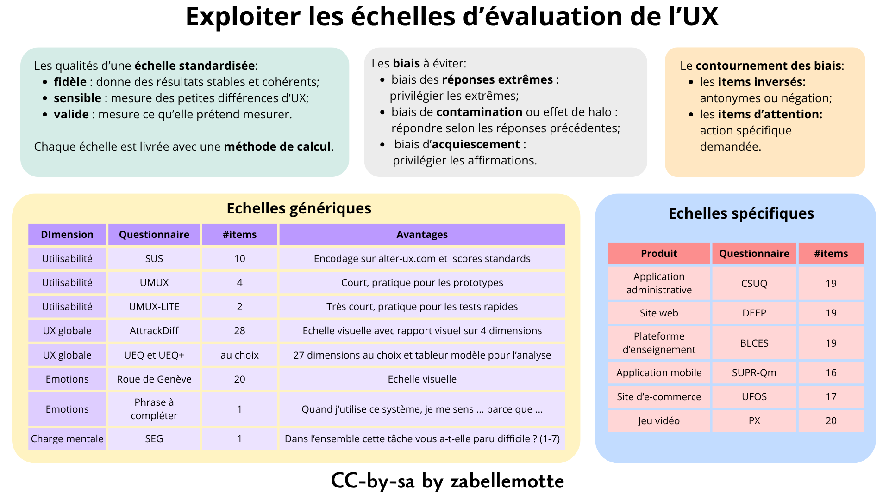
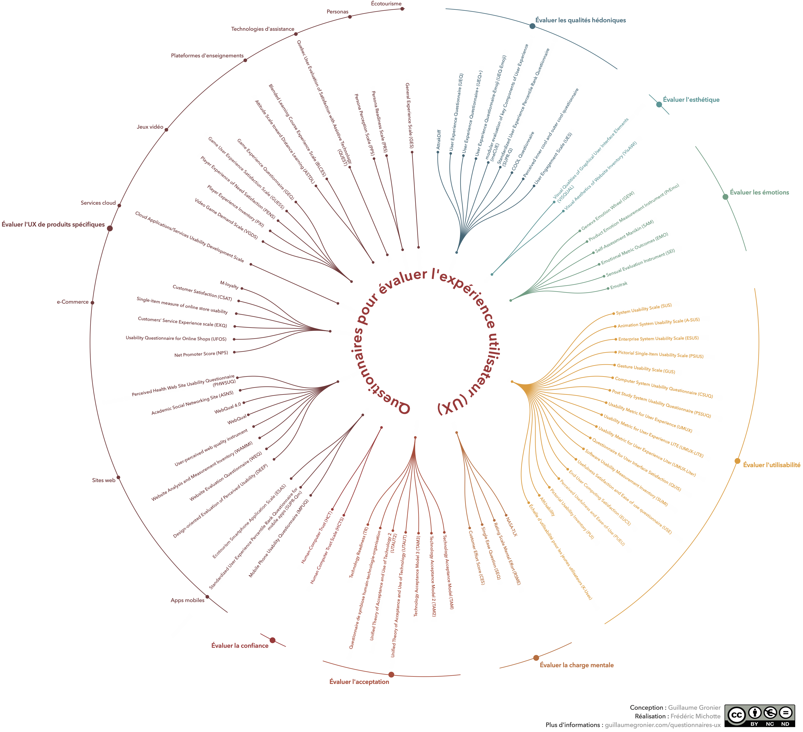

# Exploiter les échelles d'évaluation de l'UX

<h4 id="survol">En un coup d'oeil </h4>

    

      
    

    

        <dl class="zab-method-dl">
            <dt>Etape UX</dt>
            <dd>5. Evaluation</dd>
            <dt>Catégorie</dt>
            <dd>UX design</dd>
            <dt>Intérêt</dt>
            <dd>Objectiver l'UX à l'aide de métriques standardisées</dd>
            <dt>Complexité</dt>
            <dd>Simple à moyenne</dd>
            <dt>Durée</dt>
            <dd>Quelques minutes pour l'utilisateur à la fin d'un test et 1 à 2 heures pour analyser les résultats</dd>
            <dt>En vidéo</dt>
            <dd><a href="https://www.youtube.com/watch?v=eTO_k1Ln9lQ" target="_blank">Mesurer l'UX à l'aide de questionnaire - LuxIO 2024 - Guillaume Gronier (InTech S.A.)</a></dd>
        </dl>
    

  

<ul>
<li> <a href="#resume"> En résumé </a></li>
<li> <a href="#standard">Des échelles standardisées pour mesurer ce qui compte</a> </li>
<li> <a href="#biais">Les biais à éviter</a> </li>
<li> <a href="#roue">La roue des échelles UX de Guillaume Gronier</a> </li>
<li> <a href="#mine">Ma sélection d'échelles</a> </li>
<li> <a href="#histoire">La petite histoire</a> </li>
</ul>

<h4 id="resume"> En résumé</h4>

Les <b>échelles UX standardisées</b> permettent d'évaluer l'expérience utilisateur à l'issue d'un test de manière précise.
Elles peuvent cibler l'évaluation de l'utilisatibilité, des émotions, de l'UX globale ou avoir été conçue pour des produits 
spécifiques (site web, jeux vidéo, ...). Leur résultat est souvent structuré en différentes <b>dimensions</b> et il prend parfois 
la forme d'un <b>score global</b> à prendre comme référence pour évaluer l'évolution du produit.

<h4 id="standard"> Des échelles standardisées pour mesurer ce qui compte</h4>

 Pour évaluer l'UX, les échelles standardisées doivent être privilégiées car elles permettent de garantir une évaluation de qualité.
Plus précisément, les échelles standardisées rencontrent 3 conditions de qualité:
<ul> 
<li><b>fidèle</b> : le questionnaire donne des résultats stables et cohérents; </li>
<li><b>sensible</b> : le questionnaire permet de détecter des petites différences dans l'expérience utilisateur;  </li>
<li><b>valide</b>: le questionnaire mesure bien ce qu'il présend mesurer.</li>
</ul>

Les items d'un questionnaire ne peuvent pas être modifiés mais, si l'évaluation porte seulement sur un aspect précis, il est possible 
de ne retenir que les items liés à une dimension précise du questionnaire. Tous les items de cette dimension doivent alors être proposés. 
Chaque formulaire est livré avec une <b>méthode de calcul</b> pour déterminer le score pour chaque dimension 
et cette méthode ne peut pas être adaptée. Certains questionnaires proposent aussi une échelle d'analyse standardisée pour interpréter
les scores.

<h4 id="biais"> Des biais à éviter</h4>

 Lors de la réponse à un questionnaire d'évaluation, 3 biais peuvent se présenter:
<ul>
<li>
<b>le biais de réponses extrêmes</b> : le participant
coche les réponses aux extrémités des
échelles;
</li>
<li> <b> le biais de contamination ou effet de halo</b> : le
participant répond en fonction des réponses
qu’il a précédemment données;
</li>
<li> <b>le biais d’acquiescement</b> : le participant a
tendance à répondre “oui”.
</li>
</ul>

Ces biais peuvent être contournés en utilisant 2 stratégies:
<ul>
<li><b>les items inversés</b> : ces items sont fomulés à l'aide de négation ou d'antonymes;</li>
<li><b>les items d'attention</b> : ces items demandent à l'utilisateur de cocher une option spécifique ou de compéléter un champ ouvert
avec un mot spécifique et visent à vérifier s'il es attentif ou pas.
</li>
</ul>

<b> Les items négatifs exigent un post-traitement car leur score doit être recalculé en inversant l'échelle.</b> Les questions d'attention
impliquent un pré-traitement pour éliminer les réponses où ces questions ont un mauvais score. Le temps de réponse peut aussi être pris en 
compte pour éliminer les réponses de participants qui auraient répondu avec peu de sérieux.

<h4 id="roue"> La roue des échelles UX de Guillaume Gronier</h4>

Guillaume Gronier est un chercheur qui étudie des échelles UX et qui partage son travail de veille sous la forme d'une roue 
associée à une série de références et d'échelles prêtes à télécharger. Cette roue est <b>LA référence pour trouver des grilles d'évaluation de l'UX
qu'elles soient génériques ou ciblées</b>.

<h4 id="mine"> Ma sélection d'échelles</h4>

Face à l'éventail des échelles proposées, j'ai choisi d'en retenir quelques-unes pour soutenir mes pratiques UX. Je ne suis pas chercheuse mais praticienne et confrontée
chaque jour à des délais très court pour remettre des livrables. J'ai donc décider de placer dans ma boîte à outil de l'UX uniquement <b>des échelles courtes </b>
(maximum 20 items et/ou plutôt visuelles) et j'ai aussi veillé à disposer de questionnaires <b>très courts</b> à exploiter pour les tests préliminaires de maquettes basse fidélité 
ou d'embryons de prototypes. 

| Dimension | Questionnaire | #Items | Ressources | Remarques |
|---------------|------------------|--------|----------------------|--------|
| Utilisabilité | SUS (System Usability Scale)  | 10 | <a href="https://uxpajournal.org/determining-what-individual-sus-scores-mean-adding-an-adjective-rating-scale/" target="_blank">Article de référence</a> | Le rapport du SUS peut être obtenu facilement en encodant ses données via le site <a href="https://www.alter-ux.com/" target="_blank">alter-ux.com</a> et le score SUS permet de situer l’utilisabilité d’une interface par rapport à des <a href="https://uxpajournal.org/determining-what-individual-sus-scores-mean-adding-an-adjective-rating-scale/" target="_blank">niveaux de référence standardisés</a>.  |
| Utilisabilité | UMUX (Usability Metric fos User Experience) | 4 |  <a href="images/UMUX.pdf" target="_blank">Grille à imprimer</a> +  <a href="https://www.researchgate.net/publication/220054775_The_Usability_Metric_for_User_Experience" target="_blank">Article de référence</a> |  |
| Utilisabilité | UMUX-LITE | 2 |  <a href="images/UMUX-LITE.pdf" target="_blank">Grille à imprimer</a> +  <a href="https://dl.acm.org/doi/10.1145/2470654.2481287" target="_blank">Article de référence</a> |  |
| UX globale | AttrackDiff | 28 |  <a href="https://guillaumegronier.com/resources/QuestionnairesUX/AttrakDiff_FR.pdf" target="_blank">Grille à imprimer</a> +  <a href="https://www.attrakdiff.de/index-en.html" target="_blank">Article de référence</a> | Le questionnaire consiste à positionner 28 items entre 2 pôles et est encore assez rapide à compléter. Cette échelle permet de présenter les résultats en 4 dimensions avec des présentations très visuelles.|
| UX globale | UEQ et UEQ+  | 27 dimensions au choix avec 4 items chacunes | <a href="https://www.ueq-online.org/" target="_blank">Site de référence sur UEQ </a>  +  <a href="https://ueqplus.ueq-research.org/" target="_blank">Site de référence UEQ+</a> | Les sites de référence proposent les modèles de grilles à imprimer avec des items pour une vingtaine de dimensions au choix. Les modèles de fichiers tableurs pour encoder les données et générer les graphiques sont aussi disponibles au téléchargement. |
| Emotions | Roue des émotions de Genève  | 20 | <a href="images/emotions-roue-de-geneve.pdf" target="_blank">Grille à imprimer</a>  +  <a href="https://biblio.ugent.be/publication/4316382" target="_blank">Article de référence</a> | Cette grille est présentée de manière très visuelle sur une seule page. |
| Emotions | Phrase à compléter unique   | 1 | Phrase obtenue via une veille dans la littérature avec Elicit sans référence explicite associée|"Quand j'utilise ce système, je me sens ... parce que ..." |
| Charge mentale | SEQ (Single Ease Question)  | 1 | <a href="https://www.usersense.com/knowledge-base/usability-metrics/single-ease-question-seq" target="_blank">Site de référence</a> | Dans l'ensemble, cette tâche vous a-t-elle paru facile ou difficile ? (1 = très difficile, 7 = très facile)|

 

J'épingle aussi quelques questionnaires adaptés à l'évaluation de produits spécifiques:

| Produit | Questionnaire | #Items | Ressources | Remarques |
|---------------|------------------|--------|-------------------------------------|--------|
| Application administrative | CSUQ (Computer Usability Satisfaction Questionnaire)  | 19 | <a href="https://guillaumegronier.com/resources/QuestionnairesUX/SUS_FR_pdf.pdf" target="_blank">Grille à imprimer</a>  +  <a href="https://www.researchgate.net/profile/James-Lewis-8/publication/200085994_IBM_Computer_Usability_Satisfaction_Questionnaires_Psychometric_Evaluation_and_Instructions_for_Use/links/63ed7a4319130a1a4a7faef5/IBM-Computer-Usability-Satisfaction-Questionnaires-Psychometric-Evaluation-and-Instructions-for-Use.pdf" target="_blank">Article de référence</a> |  |
| Site web | DEEP (Design-oriented Evaluation of Perceived Usability)  | 19 |  <a href="https://www.tandfonline.com/doi/full/10.1080/10447318.2011.586320" target="_blank">Article de référence</a> | Les résultats du questionnaire sont souvent présentés sous forme de graphique en radar avec les différentes dimensions du questionnaire. |
| Plateforme d'enseignement | BLCES  | 19 | <a href="https://www.tandfonline.com/doi/full/10.1080/10494820.2021.1946566" target="_blank">Article de référence</a> |  |
| Application mobile| SUPR-Qm  | 16|  <a href="https://measuringu.com/wp-content/uploads/2025/03/2017_SUPR-Qm_AQuestionnaireToMeasureTheMobileAppUserExperience.pdf" target="_blank">Article de référence</a> |  |
| Site d'e-commerce | UFOS  | 17 | <a href="https://www.researchgate.net/publication/220208305_Usability_in_online_shops_Scale_construction_validation_and_the_influence_on_the_buyers'_intention_and_decision" target="_blank">Article de référence</a> |  |
| Jeu vidéo | PX  | 34 |  <a href="https://www.google.com/url?sa=t&source=web&rct=j&opi=89978449&url=https://lirias.kuleuven.be/retrieve/c6ce7687-8695-453d-9417-14489a2a3367/&ved=2ahUKEwjWq9WRvc2UAxUIUaQEHWzeCt0QFnoECB0QAQ&usg=AOvVaw2a61JpQecRVB0qO038tu8e" target="_blank">Article de référence</a> |  |

<h4 id="histoire"> La petite histoire</h4>

Les premières échelles UX sont apparues dans les années 1980 pour mesurer l’utilisabilité des systèmes informatiques. La plus connue est la System Usability Scale (SUS), créée en 1986 par John Brooke. Simple et rapide à utiliser, elle est devenue une référence pour évaluer la facilité d’utilisation et la satisfaction des utilisateurs.

Dans les années 2000, la notion d’expérience utilisateur s’est popularisée grâce aux travaux de Don Norman et de chercheurs comme Marc Hassenzahl. Les échelles UX ont alors évolué pour mesurer aussi les émotions, le plaisir et la qualité globale de l’expérience vécue par les utilisateurs.

