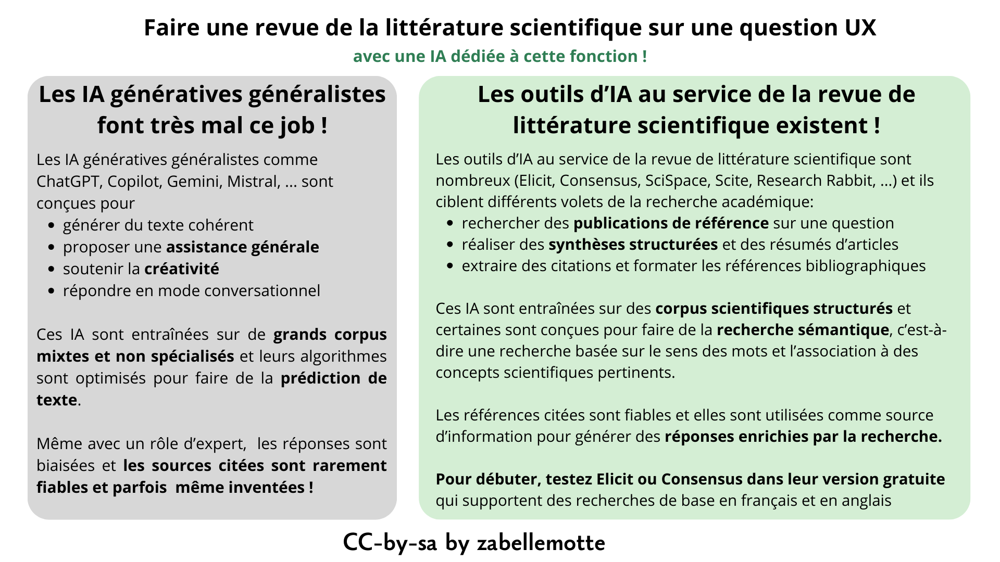

# Faire une revue de la littérature scientifique sur une question UX (avec l'IA)
<h4 id="survol">En un coup d'oeil </h4>

    

      
    

    

        <dl class="zab-method-dl">
            <dt>Etape UX</dt>
            <dd>2. Exploration</dd>
            <dt>Catégorie</dt>
            <dd>UX design</dd>
            <dt>Intérêt</dt>
            <dd>Avoir une idée des pistes de solutions recommandées dans la littérature scientifique</dd>
            <dt>Complexité</dt>
            <dd>Simple (avec l'IA)</dd>
            <dt>Durée</dt>
            <dd>Quelques heures</dd>
            <dt>En vidéo</dt>
            <dd><a href="https://www.youtube.com/watch?v=kI0hKBAxef0" target="_blank"> Search for specific keywords with Elicit (Ought)</a></dd>
        </dl>
    

  

<ul>
<li> <a href="#no"> Pas de veille scientifique avec les outils d'IA générative classiques</a></li>
<li> <a href="#special">Les outils d'IA pour la recherche académique et la revue de littérature</a> </li>
<li> <a href="#elicit">Exploiter un outil simple d'IA pour la recherche académique : Elicit</a> </li>
<li> <a href="#exemple">Exemple concret avec l'outil Elicit</a> </li>
<li> <a href="#histoire">La petite histoire ...</a> </li>
</ul>

<h4 id="no">Pas de veille scientifique avec les outils d'IA générative classiques</h4>

 
Les outils d'IA générative de type LLM généralistes (ChatGPT, Copilot, Gemini, Mistral, Claude, ...) ne sont pas adaptés à la veille scientifique, 
même en cadrant leur utilisation à un rôle d'expert. Ils n'ont pas accès aux bases documentaires scientifiques, ils sont conçus pour générer des contenus
de manière prédictive et créative, et peuvent inventer des références inexistantes.   

<h4 id="special"> Les outils d'IA pour la recherche académique et la revue de littérature</h4>

Pour la revue de la littérature scientifique, il existe de nombreux outils conçus pour rechercher des références scientifiques et pour soutenir
le travail d'analyse et de synthèse associé. L'article <a href="https://www.atlasworkspace.ai/blog/ai-for-literature-review" target="_blank">AI for Literature Review: Tools & Workflow Guide </a> du site AtlasWorkspace.ia 
référence les outils d'IA dédicacés. L'intérêt de ces outils est qu'ils sont entraînés sur des corpus de références scientifiques, 
qu'ils visent à extraire les références les plus pertinents pour les comparer, les synthétiser, ... Certains outils sont en outre dotés d'un
moteur de recherche sémantique qui extrait le sens des mots-clés de la recherche pour y associer des concepts scientifiques.

<h4 id="elicit"> Exploiter un outil simple d'IA pour la recherche académique : Elicit</h4>

L'outil <a href="https://elicit.com" target="_blank">Elicit.com </a> me semble intéressant pour faire une recherche UX simple 
car il permet de poser ses questions en langage naturel et son moteur de recherche sémantique fait le lien avec les concepts scientifiques 
de plus de 138 millions d'articles universitaires provenant de Semantic Scholar, PubMed et OpenAlex. Il couvre toutes les disciplines universitaires. 
Sa version gratuite permet déjà beaucoup et les options payantes sont (pour l'instant)
plutôt liées à la richesse des rapports d'analyse proposés et aux possibilité d'export de données.

L'outil peut être utilisé en posant une question en langage naturel. Il répond aux questions qu'elles soient exprimées en anglais ou en français. 
Mais ma préférence est de l'utiliser avec un prompt expert qui exige qu'il cite explicitement les sources associées au différents points d'analyse:

Tu es un expert du UX design, tu maîtrises la littérature scientifique liée. 
Je souhaite que tu répondes à mes questions en UX design en t’appuyant uniquement sur des sources scientifiques et 
académiques reconnues (revues spécialisées, conférences de référence, modèles théoriques validés) 
ainsi que sur des sources expertes du domaine (ex. Human–Computer Interaction, Computers in Human Behavior, 
Design Studies, actes ACM, etc.). Tes réponses doivent être argumentées, synthétiques et accompagnées de citations précises 
des auteurs et travaux mobilisés, avec un lien direct vers l’article, la publication ou le DOI lorsque cela est possible. 

<h4 id="exemple"> Exemple concret avec l'outil Elicit </h4>
Dans le cadre d'une recherche UX, imaginons que nous recherchons des solutions pour aider les personnes qui sont souvent 
interrompues dans leur travail. Le prompt et la réponse de Elicit ...

Je réalise une analyse des solutions qui peuvent aider les personnes qui sont souvent interrompues dans leur travail 
(appels téléphoniques, mails, accueil clients en présence). J'aimerais que tu présentes les options numériques 
et les options organisationnelles qui peuvent aider ces personnnes.

 

La recherche sur les interruptions au travail est abondante en IHM (Interaction Homme-Machine) et en sciences cognitives. 
La littérature identifie à la fois des solutions numériques (systèmes qui gèrent quand et comment les interruptions parviennent à l'utilisateur) 
et des stratégies organisationnelles (pratiques qui structurent l'environnement de travail). Voici une synthèse organisée autour de ces deux axes.

<h5>1. Le coût cognitif : pourquoi les interruptions comptent</h5>

Avant de présenter les solutions, il est utile de comprendre le coût. Les travaux influents d'Altmann & Trafton sur la reprise de tâche ont montré
que le « resumption lag » — le temps nécessaire pour rassembler ses pensées après une interruption — est environ le double de l'intervalle 
entre actions non interrompues (3,8 s contre 1,9 s dans leur paradigme expérimental). 
L'étude de terrain fondatrice d'Iqbal & Horvitz à CHI (n=27, citée 348 fois) a révélé que les utilisateurs mettaient en moyenne ~25 minutes pour 
revenir à la tâche initiale après une perturbation, et que de nombreuses tâches n'étaient jamais reprises. 
Brumby et al. ont démontré un compromis vitesse-précision : revenir précipitamment à une tâche après interruption augmente significativement les erreurs. 
Stangl & Riedl (2023) ont constaté chez des professionnels du numérique que 35 % des interruptions sont des « intrusions » 
et 28 % des « distractions », avec un impact globalement néfaste sur le bien-être psychologique et la performance.

<h5> 2. Solutions numériques</h5>
<h7>2.1 Gestion intelligente des notifications (temporiser l'interruption)</h7>

L'approche numérique la plus étudiée consiste à différer les notifications aux moments de faible charge cognitive. 
Iqbal & Bailey (CHI 2006, 160 citations) ont développé un modèle qui utilise les frontières de structure de tâche — les points de rupture naturels
entre sous-tâches — pour prédire le « coût de l'interruption » et reporter les notifications en conséquence. 
Leur modèle prédit le temps de reprise avec une précision élevée.

Katidioti et al. (2016) sont allés plus loin en construisant un système de gestion des interruptions (IMS) indépendant de la tâche, 
qui utilise la dilatation pupillaire en temps réel comme indicateur de charge de travail. Le système identifie les moments de faible 
charge pour délivrer les interruptions et « a réussi à trouver les moments optimaux pour les interruptions et a marginalement amélioré la performance ».

Forlivesi et al. (2018) ont conçu un système portable (wearable) qui apprend les schémas personnels d'interruptibilité par apprentissage automatique 
en ligne, reconnaissant les moments opportuns en fonction du lieu, de l'activité physique et du contexte conversationnel. 
Leur système a montré une « forte augmentation de 46 % du taux de réponse aux notifications » avec un coût en ressources négligeable.

<h7>2.2 Signaux informatifs (préparer à l'interruption)</h7>

Plutôt que de bloquer les interruptions, une autre approche fournit aux utilisateurs des informations sur l'interruption à venir afin qu'ils puissent
prendre des décisions éclairées. Ho et al. (2004, Human Factors) ont montré que fournir une connaissance préalable de la modalité et de l'urgence 
des tâches en attente conduisait les participants à retarder stratégiquement les tâches d'interruption visuelles, « ce qui leur a permis d'éviter 
les interférences intramodales et les coûts de balayage visuel ». Hameed et al. (2009, Human Factors) ont confirmé que des signaux périphériques visuels
et tactiles indiquant le domaine, l'importance et la durée prévue d'une tâche interrompante étaient « détectés et interprétés de manière fiable » 
et amélioraient la gestion des interruptions.

<h7>2.3 Aides à la reprise de tâche (récupérer après l'interruption)</h7>

Altmann & Trafton ont constaté que des indices externes disponibles juste avant une interruption facilitent la performance par la suite, 
suggérant que « les individus déploient des processus perceptifs et mnésiques préparatoires, apparemment spontanément, pour atténuer les effets
perturbateurs de l'interruption de tâche ». Clifford & Altmann (2004) ont étudié si des notes mentales ou physiques prises pendant le délai d'interruption
pouvaient réduire le temps de reprise, confirmant que les stratégies de prise de notes aident à préserver le contexte de la tâche.

Paul, Komlódi & Lutters (2015, Int. J. Hum.-Comput. Stud.) ont constaté que certains types de notifications interruptives soutiennent en réalité la 
gestion des tâches : « certains types de notifications soutiennent le multitâche, la priorisation des tâches, la gestion des tâches, et influencent 
également la gestion des perturbations ». L'essentiel est de concevoir des notifications actionnables plutôt que simplement alertantes.

<h7>2.4 Affichages de disponibilité (pour les interruptions en face-à-face)</h7>

Szóstek & Markopoulos (CHI 2006) ont spécifiquement étudié les interruptions en face-à-face dans les bureaux et identifié des opportunités pour 
des « solutions interactives qui soutiennent à la fois les interrupteurs et les interrompus ». Leurs travaux ultérieurs ont proposé des systèmes 
de conscience situationnelle (awareness systems) — des affichages numériques signalant le statut actuel d'interruptibilité d'un travailleur 
aux interrupteurs potentiels, permettant une négociation sociale avant que l'interruption ne se produise.

<h5>3. Solutions organisationnelles</h5>

Kalliomäki-Levanto & Ukkonen (2022, Information Technology and People) ont soutenu que la plupart des solutions de gestion des interruptions 
« laissent presque toujours la responsabilité et le fardeau des interruptions aux travailleurs du savoir individuels » et ont proposé une 
approche au niveau du système. Ils ont montré que les données de traces des systèmes TIC, combinées à l'apprentissage automatique, peuvent 
identifier les situations interrompantes au niveau organisationnel, permettant aux entreprises de reconcevoir les flux de travail plutôt 
que de s'appuyer sur des stratégies d'adaptation individuelles.

Stangl & Riedl (2023) ont spécifiquement recommandé que « les entreprises doivent développer des stratégies pour que les employés puissent 
travailler efficacement » face à la surcharge d'interruptions — soulignant la nécessité de politiques organisationnelles 
(par ex. heures calmes désignées, regroupement des consultations d'e-mails, rotation des fonctions en contact avec la clientèle) 
en complément des outils numériques.

Arroyo & Selker (INTERACT 2011) ont proposé un cadre de gestion des perturbations (Disruption Management Framework) adoptant une vision holistique, 
avec une architecture à trois couches : « une couche de connaissances incluant des informations sur les sujets liés à l'activité en cours, 
une couche intermédiaire incluant des informations résumées sur les tâches de l'utilisateur et leurs étapes, et une couche de bas niveau » 
qui évalue si et comment présenter les interruptions en fonction des objectifs et motivations de l'utilisateur.

<h5>Synthèse des approches pratiques</h5>
<table>
<thead>
<tr><td>Stratégie</td><td>Type</td><td>	Mécanisme</td><td>	Références clés</td></tr></thead>
<tbody>
<tr><td>Report de notifications aux points de rupture</td><td>	Numérique</td><td>	Retarde les alertes aux frontières naturelles de tâche</td><td>	Iqbal & Bailey, 2006</td></tr>
<tr><td>Détection physiologique (dilatation pupillaire)	</td><td>Numérique</td><td>	Détecte les moments de faible charge en temps réel</td><td>	Katidioti et al., 2016</td></tr>
<tr><td>Modélisation d'interruptibilité portable</td><td>	Numérique</td><td>	Apprend les schémas personnels de disponibilité</td><td>	Forlivesi et al., 2018</td></tr>
<tr><td>Signaux pré-informatifs</td><td>Numérique	</td><td>Signale l'urgence/modalité avant l'interruption</td><td>	Ho et al., 2004 ; Hameed et al., 2009</td></tr>
<tr><td>Indices de reprise de tâche et prise de notes</td><td>	Numérique/Individuel</td><td>	Préserve le contexte à travers les interruptions</td><td>	Altmann & Trafton, 2004</td></tr>
<tr><td>Affichages de disponibilité	</td><td>Numérique/Social</td><td>	Signale l'interruptibilité aux collègues</td><td>	Szóstek & Markopoulos, 2006</td></tr>
<tr><td>Reconception des flux au niveau système</td><td>	Organisationnel</td><td>	Utilise les traces TIC pour identifier et réduire les schémas d'interruption	</td><td>Kalliomäki-Levanto & Ukkonen, 2022</td></tr>
<tr><td>Politiques organisationnelles (heures calmes, regroupement)	</td><td>Organisationnel	</td><td>Structure les moments où les interruptions peuvent survenir	</td><td>Stangl & Riedl, 2023</td></tr>
</tbody>
</table>

Les données convergent vers un principe clair : l'approche la plus efficace combine des outils numériques qui gèrent le moment 
(délivrer les interruptions aux moments les moins coûteux) avec des politiques organisationnelles qui réduisent le volume 
(moins d'interruptions inutiles en premier lieu). Aucune des deux approches ne suffit à elle seule.

L'outil donne le plus souvent accès à l'article complet pour lecture plus approfondie. Un bon point de départ pour entamer une réflexion par rapport à une question UX ...

<h4 id="more"> Autres outils équivalents </h4>

Votre assistant IA préféré vous permettra à tout moment de comparer les outils d’IA pour la recherche scientifique et la revue de littérature.
Mes tests se sont arrêtés à Elicit qui m'a semblé le plus simple à tester de prime abord, mais vous pourriez aussi aimer 
<a href="https://consensus.app" taget="_blank"> Consensus</a> qui propose 
directement des réponses basées sur les preuves en faisant une synthèse automatisée d'études.

<h4 id="histoire"> La petite histoire ...</h4>

 Elicit est un outil d’IA développé par le laboratoire Ought (Californie) pour automatiser la recherche et la synthèse de littérature scientifique. 
Lancé vers 2020, il utilise des modèles de langage et une recherche sémantique sur des millions d’articles pour faciliter les revues systématiques. 
Rapidement adopté par chercheurs et étudiants, il permet d’extraire, organiser et résumer les données issues des publications. 
L’outil a évolué pour inclure des workflows avancés et des analyses structurées. Aujourd’hui, Elicit est utilisé internationalement pour accélérer 
et structurer la veille scientifique.

<h6> Cet article et ses illustrations sont partagées sous licence <a href="https://creativecommons.org/licenses/by-sa/4.0/deed.fr" target="_blank">Creative Commons-by-sa</a>. </h6> 