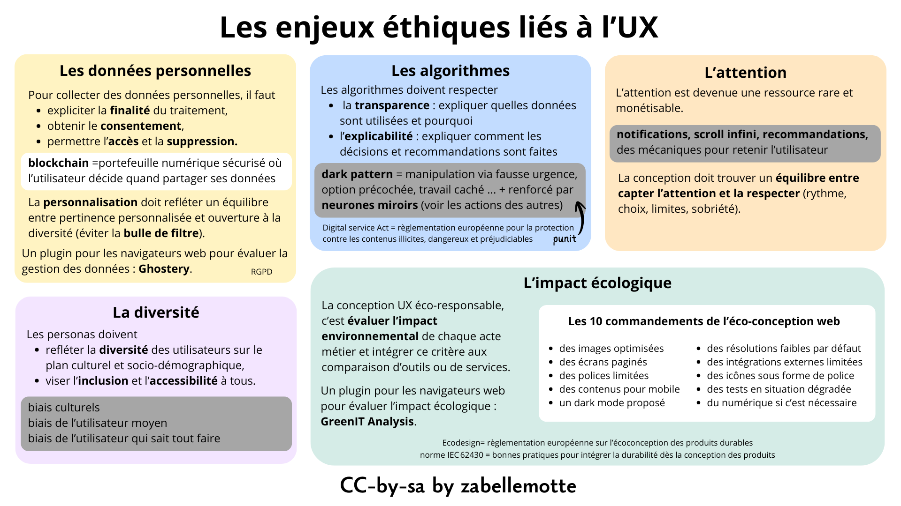

# Questionner les enjeux éthiques dès le départ
<ul>
<li> <a href="#poles"> 5 pôles pour envisager les enjeux éthiques</a> </li>
<li> <a href="#donnees"> Le respect des données personnelles : finalité, consentement et souveraineté </a></li>
<li> <a href="#algo"> Des algorithmes transparents et explicables </a> </li>
<li> <a href="#attention"> L'attention de l'utilisateur comme ressource finie </a> </li>
<li> <a href="#diversite"> Des personas au service de la diversité, de l'insclusion et de l'accessibilité</a> </li>
<li> <a href="#eco"> L'impact écologique maîtrisé au travers de l'éco-conception</a> </li>
</ul>

<h4 id="poles"> 5 pôles pour envisager les enjeux éthiques</h4>

 Les enjeux éthiques sont présentés au travers de 5 pôles critiques:
<ul>
<li> les données personnelles des utilisateurs qui sont collectées,</li>
<li> les algorithmes utilisés pour trier les résultats de recherche, proposer des recommandations et personneliser l'expérience utilisateur,</li>
<li> l'attention des utilisateurs qui est devenue une ressource monétisable et rare,</li>
<li> la diversité dans la manière d'envisager les personas, </li>
<li> l'impact écologique du produit ou service</li>
</ul>

Ces 5 pôles sont détaillés dans l'infographie ci-dessous et dans les sections suivantes.

<h4 id="donnees"> Le respect des données personnelles : finalité, consentement et souveraineté </h4>

La plupart des services exigent aujourd'hui que les utilisateurs partagent des données personnelles. 
Ces données sont utilisées pour permettre une <b> personnalisation</b> de l'expérience utilisateur au travers de recommandations ou d'options de filtre avancées.
Mais la collecte de ces données est encadrée en Europe par le <a href="https://www.edps.europa.eu/data-protection/data-protection/legislation/history-general-data-protection-regulation_fr" target="_blank">réglement générale sur la protection des données (RGPD).</a>

Cette réglementation se décline comme suit:  
<ul>
<li> l'utilisateur doit donner son <b>consentement</b> pour la collecte de ses données,</li>
<li> il doit être informé de la <b>finalité</b> des traitements réalisés,</li>
<li> il doit rester <b>souverain</b> dans la gestion de ces données, c'est-à-dire être en mesure d'y accéder, de les rectifier et de les supprimer.</li> 
</ul>

 La personnalisation doit rester pertinente et éviter d'enfermer l'utilisateur dans une <b> bulle de filtre</b> qui serait à l'encontre de la diversité.
Ce risque est particulièrement grand avec les outils d'IA qui sont conçus pour être conciliants.

 La <b>blockchain</b> pourrait devenir une approche plus respectueuse des utilisateurs pour la gestion de la collecte et du partage de données, 
puisqu'elle permet à l’utilisateur de contrôler lui-même, via un portefeuille numérique sécurisé, les accès à ses données et leur partage au cas par cas.

<h4 id="algo"> Des algorithmes transparents et explicables </h4>

Les données des utilisateurs sont traitées via des algorithmes qui peuvent parfois être très obscurs. 
Les résultats d'une recherche peuvent par exemple privilégier l'affichage de résultats sponsorisés dont la caractère sponsorisé est parfois très peu mis en évidence.
Pour que le respect des données utilisateurs soit garanti, il faut respecter la <b>transparence</b> et l'<b>explicabilité</b>.
Un algorithme transparent est un algorithme dont l’utilisateur sait qu’il est utilisé, quelles données il mobilise et dans quel but il produit des résultats ou des décisions.
Un algorithme explicable est un algorithme qui permet à l’utilisateur de comprendre pourquoi un résultat, une recommandation ou une décision lui est présenté.
Le design UX doit donc réussir à informer sans complexifier.

 Certains services vont jusqu'à manipuler l'utilisateur via des <b>dark patters</b> qui peuvent prendre différentes formes :
<ul>
<li> simuler une situation d'urgence ("Seulement 3 produits restants à ce prix"),</li>
<li> proposer une option payante cochée par défaut, </li>
<li> exploiter des <b>travailleurs cachés </b> pour biaiser les évaluations ou recommandations,</li>
<li> exploiter les mécanismes de <b>neurones miroirs</b> en présentant les actions des autres utilisateurs de manière incitative.</li>
</ul>

Ces méthodes sont aujourd'hui punissables par le
<a href="https://france.representation.ec.europa.eu/informations/le-digital-services-act-mode-demploi-2025-02-27_fr" target="_blank">
Digital Service Act européen</a> qui vise à garantir la sécurité des utilisateurs, la transparence des contenus et la responsabilité des services numériques.

Le site <a href="https://designersethiques.org/fr/" target="_blank">designersethiques.org</a> 
propose des recommandations pour un design éthique et notamment 
<a href="https://designersethiques.org/fr/thematiques/design-persuasif#1.-%C3%8Atre-en-mesure-de-visibiliser-les-dark-patterns-(mesurer,-%C3%A9valuer)" target="_blank">une approche pour visibiliser les dark patterns</a>.

<h4 id="attention"> L'attention de l'utilisateur comme ressource finie </h4>

Pour Yves Citton, l’économie n’est plus seulement fondée sur la production de biens matériels, 
mais sur la capture et la mise en valeur de l’attention humaine, devenue une ressource rare. 
Les médias et plateformes numériques se livrent une concurrence permanente pour capter cette attention, 
souvent en la fragmentant et en la sollicitant de manière continue. Cette logique favorise des contenus émotionnels, 
polarisants ou simplificateurs, au détriment de formes d’attention plus lentes, réflexives et collectives. 
L’attention n’est donc pas neutre : elle structure notre rapport au monde.

Citton insiste sur le fait que l’attention n’est pas seulement une ressource à exploiter, mais un bien commun à cultiver
et à protéger. Il appelle à développer une <b>écologie de l’attention</b>, c’est-à-dire un ensemble de pratiques sociales, 
culturelles et politiques visant à préserver des régimes d’attention soutenables, émancipateurs et partagés. 
Cela implique de repenser les dispositifs techniques, éducatifs et médiatiques afin de renforcer l’autonomie des individus 
et leur capacité à orienter consciemment leur attention, plutôt que de la laisser être capturée par des logiques purement marchandes.

Certains services exploitent des approches qui visent à retenir l'utilisateur : notifications fréquentes, scroll infini, recommandations multiples, ...
L'UX design doit trouver un <b>équilibre entre capter l'attention et la respecter</b>.

<h4 id="diversité">  Des personas au service de la diversité, de l'inclusion et de l'accessibilité </h4>

Les personas sont censés représenter les utilisateurs réels, mais ils peuvent facilement devenir des projections biaisées des concepteurs. 
Ces biais apparaissent dès la sélection des profils, des données et des hypothèses utilisées pour les construire:
<ul>
  <li><b>Biais de projection :</b> le concepteur projette ses propres usages, compétences et valeurs sur l’utilisateur.</li>
  <li><b>Biais de représentativité :</b> les personas reflètent seulement une partie dominante ou visible des utilisateurs, oubliant les profils marginaux ou atypiques.</li>
  <li><b>Biais socio-culturels :</b> les normes culturelles, linguistiques ou sociales du concepteur influencent la perception des utilisateurs.</li>
  <li><b>Biais de genre et stéréotypes :</b> association implicite de certaines tâches, comportements ou compétences à un genre ou rôle social.</li>
  <li><b>Biais de données :</b> personas construits à partir de données partielles, incomplètes ou biaisées, sans tenir compte des non-utilisateurs.</li>
  <li><b>Biais de finalité :</b> personas orientés pour justifier des choix stratégiques ou économiques plutôt que pour représenter les besoins réels.</li>
</ul>

Prendre en compte l'<b>accessibilité</b> exige aussi d'integrer des capacités et contextes variés d'utilisation. 
Un service accessible est un service qui fonctionne pour tout le monde, pas seulement pour l’utilisateur “idéal”.

La notion de « <b>Turing-Complete User</b> », popularisée par Bret Victor, désigne une critique du design logiciel qui suppose
implicitement que l’utilisateur est capable de compenser la complexité d’un système par ses propres efforts cognitifs. 
Cette vision est problématique du point de vue de l’UX et de l’éthique, car elle transfère la charge de complexité du système 
vers l’utilisateur et favorise l’exclusion.

<h4 id="eco">  L'impact écologique maîtrisé au travers de l'éco-conception </h4>

Les chiffres sur l'impact écologique du numérique sont alarmants:
<ul>
<li> le nombre d'objets connectés a été multiplié par x48 de 2010 à 2025 (source <a href="https://www.greenit.fr/etude-empreinte-environnementale-du-numerique-mondial/" target="_blank"> GreenIT</a>)</li>
<li> la fabrication du matériel est le premier impact du numérique (source <a href="https://www.arcep.fr/uploads/tx_gspublication/etude-numerique-environnement-ademe-arcep-note-synthese_janv2022.pdf target="_blank">ARCEP - Etude d'impact environnemental</a>)</li>
<li> les européens sont les plus gros producteurs de déchets par habitant (source <a href="https://www.greenit.fr/2020/07/03/dechets-electroniques-21-en-5-ans/" target="_blank">GreenIT</a>)</li>
<li> l’IA représente actuellement 20% de la consommation électrique mondiale des data centers (<a href="https://geeko.lesoir.be/2026/01/05/lia-consomme-autant-deau-que-toute-leau-en-bouteille-du-monde" target="_blank">source Geeko</a>)</li>
<li> ...</li>
</ul>

L'<b>éco-conception</b> vise à intégrer l'impact environnemental dès la conception d'un produit ou service et lors de toutes les étapes de son cycle de vie.
Un service numérique est constitué de l'ensemble des matériels, logiciels et infrastructures qui permettent de réaliser une action au format numérique.

La norme <a href="https://www.iso.org/fr/standard/79064.html" target="_blank">IEC 62430</a> fournit un cadre volontaire de bonnes 
pratiques pour intégrer la durabilité dès la conception des produits. 
Le <a href="https://commission.europa.eu/energy-climate-change-environment/standards-tools-and-labels/products-labelling-rules-and-requirements/ecodesign-sustainable-products-regulation_en?prefLang=fr" target="_blank">règlement européen Écodesign (ESPR)</a>, 
lui, fixe des exigences obligatoires de réparabilité, recyclabilité et efficacité énergétique pour tout produit mis sur le marché européen. 
Ensemble, ils guident les concepteurs vers des produits à la fois écologiques et conformes à la loi.

La démarche d'éco-conception vise à <b>évaluer</b> l'empreinte environnementale des différents actes métiers proposés par la service et repose aussi sur
la nécessité de <b>comparer</b> les services via une analyse de cycle de vie.

Des grilles d'analyse émergent, comme l'<b>éco‑index</b> qui est un outil français qui mesure l’impact environnemental des pages web (émissions de CO₂, consommation d’énergie et poids de la page) pour aider les développeurs à créer des sites plus responsables.
Cette métrique concrète est le fruit du projet <a href="https://www.greenit.fr/" target="_blank">GreenIT.fr</a> qui vise à évaluer la “durabilité” des sites web.
Cette initiative a aussi permis le développement d'extensions de navigateur pour afficher l'empreinte écologique d'une page web, basée sur l'éco-index. 
Une manière simple d'optimiser ou de comparer des services pour un parcours client défini ... 
<a href="https://addons.mozilla.org/fr/firefox/addon/greenit-analysis/" target="_blank">Télécharger GreenIT Analysis pour Firefox</a> 
<a href="https://chromewebstore.google.com/detail/greenit-analysis/mofbfhffeklkbebfclfaiifefjflcpad?hl=fr" target="_blank">Télécharger GreenIT Analysis pour Chrome</a>

Pour les concepteurs web, les <b>recommandations</b> peuvent être résumées comme suit:
<ul>
<li> optimiser l'utilisation des images : taille, résolution pas pour les icônes, ...</li>
<li> privilégier les polices comme Font Aweson pour afficher les icônes,</li>
<li> éviter les pages avec du scroll infini et afficher des résultats de recherche paginés,</li>
<li> limiter le nombre de polices utilisées (max 2) et les variantes (max 4) et préférer les polices natives aux polices téléchargées,</li>
<li> envisager le design mobiles first pour simplifier les contenus et éviter une adapation pour ce support,</li>
<li> proposer un mode dark ou supporter le mode dark des navigateurs principaux</li>
<li> privilégier le partage de de médias avec des résolutions faibles par défaut</li>
<li> limiter le nombre d'intégrations externes (carte interactive, réseaux sociaux, ...) et les remplacer autant que possible par des liens,</li>
<li> veiller à tester le site en situation dégradée (mauvaise connexion),</li>
<li> envisager la numérisation de services uniquement quand c'est nécessaire.</li>
</ul>

<h6> Cet article et ses illustrations sont partagées sous licence <a href="https://creativecommons.org/licenses/by-sa/4.0/deed.fr" target="_blank">Creative Commons-by-sa</a>. </h6> 
