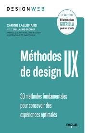
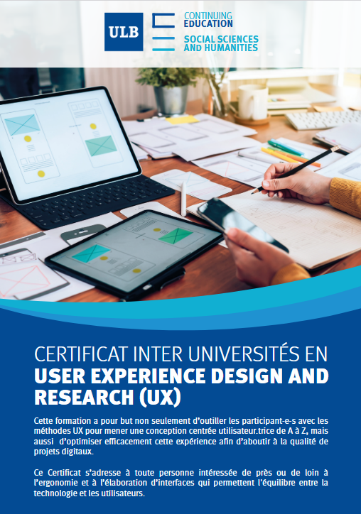

# Références
Les articles de ce site s'inspirent des références suivantes ...

 

 
 
 Le livre <i>Méthodes de design UX 
- 30 méthodes fondamentales pour concevoir des expériences optimales</i> de Carine Lallemand et Guillaume Gronier (2ième édition)"
est une référence incontournable pour découvrir le UX design. La structure de ce site et les articles émanant de l'approche UX s'en inspirent largement.

 
 
Le livre <i>Pratiques de management de projet - 50 outils et techniques pour réussir vos projets</i> de Vincent Drecq est une belle référence pour décourvrir
les méthodes de gestion de projet et les approches proposées me semblent intéressantes pour nourrir la démarche UX, en particulier les phases de
début qui visent à analyser et à prioriser les besoins.

 

 
Mes articles sont aussi largement inspirés des cours du <a href="https://husci.be/formation/certificat-inter-universites-en-user-experience-design-and-research-ux/" target="_blank">
Certificat inter-universités en user experience and research (UX)</a> auquel j'ai participé de janvier à juin 2026.
Les différents enseignants de ce programme m'ont permis d'intégrer l'intérêt des méthodes proposées et les conseils pratiques pour leur mise en application.

 

 
 
Les visuels et infographies des articles de ce site ont été réalisées avec la version gratuite de service en ligne <a href="https://www.canva.com" target="_blank">canva.com</a>.
Les modèles proposés par Canva sont nombreux et inspirants et je signale que je n'ai pas fait usage d'outil IA internes ou externes au service car j'ai toujours trouvé mon
bonheur dans les modèles gratuits. Pour quelques illustrations, j'ai intégré des images externes libres de droit et je l'ai alors explicitement signalé dans l'image et dans le texte.

Tout au long de la rédaction, mes échanges ont été nourris par des interactions avec des outils d'IA comme ChatGPT et Copilot.
Ces outils m'ont permis de clarifier certains points et de synthétiser certaines parties comme les sections "La petite histoire ..." 
ou les paragraphes qui résument la pensée d'un auteur.

