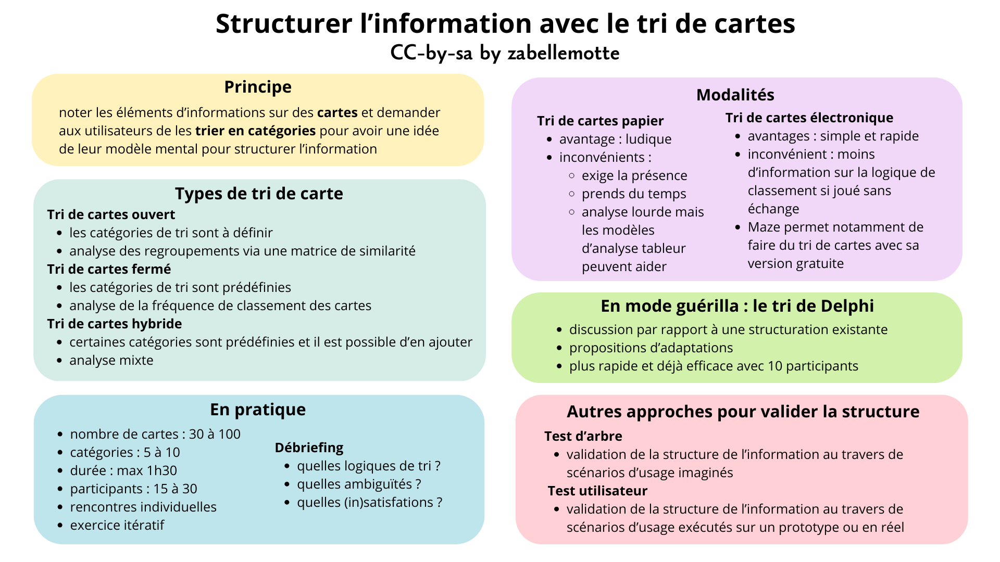

# Structurer l'information avec le tri de cartes

<h4 id="survol">En un coup d'oeil </h4>

    

      
    

    

        <dl class="zab-method-dl">
            <dt>Etape UX</dt>
            <dd>4. Génération</dd>
            <dt>Catégorie</dt>
            <dd>UX Design</dd>
            <dt>Intérêt</dt>
            <dd>Extraire le modèle mental des utilisateurs pour organiser l'information</dd>
            <dt>Complexité</dt>
            <dd>Moyenne</dd>
            <dt>Durée</dt>
            <dd>Quelques jours</dd>
            <dt>En vidéo</dt>
            <dd><a href="https://www.youtube.com/watch?v=d9SIbri2HlA" target="_blank">Remote card sorting (NNGroup)</a></dd>
        </dl>
    

  

<ul>
<li> <a href="#resume"> En résumé </a></li>
<li> <a href="#types">Les types de tri de carte</a> </li>
<li> <a href="#comment">Comment l'appliquer ?</a> </li>
<li> <a href="#exemple">Exemple concret</a> </li>
<li> <a href="#variante">La variante du tri de Delphi</a> </li>
<li> <a href="#histoire">La petite histoire</a> </li>
</ul>

<h4 id="resume"> En résumé</h4>

 Le tri de carte est une méthode de conception qui permet d'<b>organiser les éléments d'un système de manière à correspondre aux modèles mentaux des utilisateurs</b>.
Cette méthode permet de définir la navigation dans une application ou un site web, d'organiser les produits sur un site d'e-commerce, d'organiser les rayons dans un magasin, ...

 En pratique, l'utilisateur est amené à <b>trier des éléments d'information rédigés sur des cartes</b>.
Les catégories peuvent être libres ou imposées, selon la maturité de la réflexion. L'exercice est réalisé individuellement avec plusieurs personnes, 
donne lieu à une analyse et à des ajustements, puis est itéré jusqu'à obtenir un résultat cohérent. 
Les cartes peuvent être matérialisées par des post-its réels ou virtuels
et il existe des applications dédicacées qui facilitent l'analyse des résultats.

<h4 id="types"> Les types de tri de carte </h4>

 Le tri de carte se décline en 3 types :
<ul>
<li> <b> le tri de carte ouvert</b>: les catégories ne sont pas prédéfinies; les utilisateurs sont d'abord inviter à créer des ensembles logiques d'éléments puis ils doivent associer un libellé à chaque ensemble;  </li>
<li> <b> le tri de carte fermé</b>: les catégories sont prédéfinies; les utilisateurs doivent classer les éléments dans les catégories données et indiquer si des éléments leurs posent difficulté;</li>
<li> <b> le tri de carte hybride</b>: certaines catégories sont prédéfinies (elles peuvent avoir été consolidées au cours de tris de carte précédents) mais les utilisateurs sont libres de construire de nouvelles catégories si souhaité.  </li>
</ul>

 La structuration d'un système peut aussi être éprouvée pas deux autres approches plus en aval du processus de conception:
<ul>
<li> <b> le test d'arbre</b>: l'arbre des éléments est fourni à l'utilisateur et l'exercice vise à décrire le cheminement utilisé pour réaliser un scénario d'usage donné;  </li>
<li> <b> le test utilisateur</b>: l'utilisateur est plongée dans un scénario d'usage à réaliser sur un prototype ou sur le système réel et sa manière de naviguer est analysée.</li>
</ul>

<h4 id="comment"> Comment l'appliquer ?</h4>

Les infos pratiques pour préparer un  tri de carte:
<ul>
<li>combien de cartes ? l'exercice se joue en général avec <b>30 à 100 cartes</b>;</li>
<li>combien de catégories ? le tri aboutit en général à <b>5 à 10 catégories</b>;</li>
<li>quelle durée ? l'exercice se joue en général en <b>1h30</b>;</li>
<li>combien de participants ? <b>15 à 30 participants</b>, sondés 5 personnes puis analyser, adapter et itérer;
<li>exercice individuel ou collectif ? l'exercice se mène de manière <b>individuelle</b> car la dynamique de groupe peut influencer les résultats.
</ul>

 Le tri de carte peut-être réalisé selon une modalité papier ou selon une modalité électronique. Les deux approches ont des avantages et inconvénients:
<ul>
<li>le <b>tri papier</b> est ludique mais exige une participation en présence et prend pas mal de temps pour être joué et analysé;
<li>le <b>tri électronique</b> permet une implémentation et une analyse simples et rapides, mais il ne permet pas un feedback aussi explicite sur les résultats;
l'approche est plutôt à privilégier pour les tri ouverts, en début d'analyse, ou pour les tris fermés pour objectiver la cohérence d'un tri avec de nombreux participants.
</ul>

 Notez que l'outil <b><a href="https://maze.co/" target="_blank">Maze</a></b> est un outil de soutien à la démarche UX qui permet notamment de piloter des tris de cartes électroniques
(mais aussi des enquêtes, des test de prototypes, ...). Sa version gratuite permet de piloter un projet par mois et 3 activités participatives (testé en mars 2026).

Un atelier de tri de carte se clôture par un <b>débriefing</b> où 3 questions sont posées au participant pour nourrir la réflexion sur l'évolution des catégories:
<ul>
<li>Quelles <b>logiques</b> de tri avez-vous utilisées ? </li>
<li>A quelles <b>ambiguïtés</b> avez-vous été confronté ?</li>
<li>Dans quelle mesure êtes-vous <b>satisfait</b> du résultat ?</li>
</ul>

Les <b>résultats</b> d'un tri de cartes peuvent être <b>analysés</b> selon différentes approches, selon l'objectif visé:
<ul>
<li>les résulats d'un <b>tri ouvert</b> peuvent être étudiés
dans une <b>matrice de similarité</b>, qui n'intègre pas les libellés des catégories mais permet de révéler les associations de cartes les plus fréquentes; 
<a href="images/TriCartesOuvert.xlsx"> Voir un template Excel pour réaliser une matrice de similarité </a></li>
<li> les résultats d'un <b>tri fermé</b> peuvent être révisés via une <b>analyse de la fréquence de classement</b> des cartes 
et un <b>indice de fiabilité de chaque catégorie</b> peut être calculé; 
<a href="images/TriCartesFerme.xlsx"> Voir un template Excel pour réaliser une analyse de fréquence et un calcul de similarité </a></li>
</ul>
Les modèles fournis sont conçus pour permettre l'encodage des données d'un tri comptant jusqu'à 100 cartes avec maximum 20 participants. 
Vous pouvez les exploiter pour des tris moins conséquents sans altérer le traitement.

<h4 id="exemple"> Exemple concret</h4>
Prochainement ...

<h4 id="variante"> La variante du tri de Delphi </h4>

 Le tri de Delphi est une approche guérilla qui permet de réduire le temps de passation. 
Les partipants reçoivent les <b>cartes déjà triées</b> et sont invités à <b>commenter</b> la structure proposée et à la <b>modifier</b> si souhaité.
Les études ont montré que cette approche permettait d'aboutir à une structure cohérente avec seulement 8 à 10 participants. 
Cette approche qui exige moins de participants réduit aussi le temps de passation et simplifie l'analyse. 
 

<h4 id="histoire"> La petite histoire</h4>

Le tri de cartes s’est développé dans les années 1990 dans le champ de l’ergonomie et de l’architecture de l’information, 
parallèlement à l’essor du web et des démarches de conception centrée utilisateur. 
La méthode a été notamment formalisée et diffusée par des chercheurs comme William Tullis. 
Elle s’inscrit dans un mouvement plus large influencé par les travaux de Don Norman, qui ont contribué à
 mettre en avant l’importance des modèles mentaux des utilisateurs dans la conception des systèmes interactifs.

