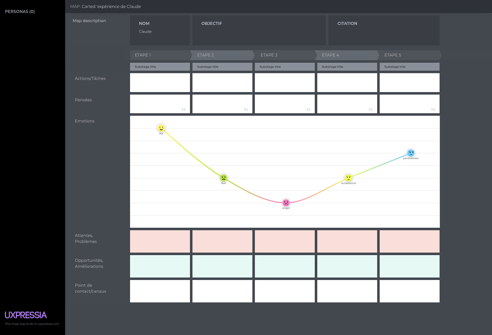

# Synthétiser l'expérience utilisateur avec les personas et les cartes d'expérience chronologiques
<h4 id="survol">En un coup d'oeil </h4>

    

      
    

    

        <dl class="zab-method-dl">
            <dt>Etape UX</dt>
            <dd>3. Idéation</dd>
            <dt>Catégorie</dt>
            <dd>UX design</dd>
            <dt>Intérêt</dt>
            <dd>Garder le focus sur les utilisateurs tout au long du processus de conception</dd>
            <dt>Complexité</dt>
            <dd>Difficile</dd>
            <dt>Durée</dt>
            <dd>Plusieurs jours</dd>
            <dt>En vidéo</dt>
            <dd><a href="https://www.youtube.com/watch?v=rv9yfrV-EAs" target="_blank"> Personas 101 (NNGroup)</a></dd>
        </dl>
    

  

<ul>
<li> <a href="#resume"> En résumé</a></li>
<li> <a href="#persona1">Construire des personas</a> </li>
<li> <a href="#persona2">Rédiger une fiche persona</a> </li>
<li> <a href="#exmap">Séquencer les parcours avec les cartes d'expérience</a> </li>
<li> <a href="#process">Exploiter les personas et les certes d'expérience tout au long du processus</a> </li>
<li> <a href="#histoire">La petite histoire </a> </li>
</ul>

<h4 id="resume"> En résumé </h4>

Les personas sont des archétypes utilisateurs créés à partir de données réelles recueillies pendant la phase d'exploration.
Chaque persona représente une <b> partie significative des personnes dans le monde réel</b> et permet au concepteur de se concentrer sur un groupe de 
personnages gérables et mémorables, au lieu de se concentrer sur des milliers d'individus.

 Pour moi qui ait un bagage en mathématiques, 
j'ai l'impression que la composition de personas s'apparente à déterminer les utilisateurs de base du système. 
Les autres utilisateurs peuvent être considérés comme des combinaisons de ces utilisateurs de base et, en concevant un système 
qui prend en compte les besoins des utilisateurs de base, on a la garantie de répondre aux besoins de tous les utilisateurs.

 Les cartes d'expérience retracent le vécu d'un persona en contact avec un service ou un système de manière chronologique. A chaque étape, 
une carte d'expérience indique les actions réalisées, les émotions, les points de friction et d'amélioration possibles.

<h4 id="persona1"> Construire des personas </h4>

Les personas sont exploitées en ux et en marketing mais le focus associé est différents puisque <b>le persona ux représente l'utilisateur</b>, 
alors que le persona marketing représente l'acheteur (qui n'est pas forcément utilisateur).
 

 
 La composition des personas ux est menée en partant des proto-personas et en s'inspirant de l'exercice réalisé pour compiler les insights.
 Les caractéristiques différenciantes et les similarités aident à faire émerger les profils types d'utilisateurs.
 

 

 Dans l'article <a href="rediger-une-fiche-projet-pour-cadrer-la-demande.html"> Rédiger une fiche projet pour cadrer la demande </a>, des proto-personas
 sont déjà définis dans la phase de planification. Ces proto-personas sont composés des éléments suivants:
 <ul>
    <li> <b>le titre</b> qui le définit,</li>
    <li> <b>les caractéristiques</b> de ce persona en terme socio-démographique, de contexte d'usage, ...</li>
    <li> <b>les jobs-to-be-done</b> par ce profil utilisateur, </li>
    <li> <b>le poids</b> de ces utilisateurs, qui peut être lié à leur nombre ou à leur fréquence d'utilisation,</li>
    <li> <b>la priorité</b> avec laquelle leurs besoins doivent être rencontrés.</li>
</ul>
Ces proto-personas doivent être considérés comme des brouillons de personas qui doivent être confrontés aux données récoltées.

Les insights sont dérivés au travers de la méthode décrites dans l'article <a href="compiler-les-donnees-sous-forme-d-insights-utilisateurs-avec-les-modeles-mentaux.html">
Compiler les données sous forme d'insights utilisateurs avec une approche inspirée des modèles mentaux </a>. Ils représentent une synthèse de l'expérience utilisateur.

 La composition des personas repose sur l'<b>analyse des caractéristiques différenciantes et des similarités</b> entre utilisateurs.
Plus précisément, les règles suivantes peuvent être appliquées pour composer les personas:
<ul>
<li> repérer les caractéristiques différenciantes;</li>
<li> regrouper les utilisateurs qui ont 70 à 80% de caractéristiques similaires; </li>
<li> prioriser selon les caractéristiques importantes (qui représente le plus d'utiisateurs, qui ont un impact plus important sur les bénéfices, 
qui sont plus faciles à recruter, ...). </li>
</ul>
Les projets d'envergure normale devraient aboutir à <b>3 à 5 personas</b>. Pour les grosses entreprises, l'analyse sera segmentée par secteur 
et selon les priorités car il n'est pas réaliste de faire un travail de conception efficient sur base d'une dizaine de personas.

<h4 id="persona2"> Rédiger une fiche persona </h4>

 Les personas sont présentés sous la forme d'une fiche synthétique au format A4 avec les éléments suivants:
<ul>
<li> Identité :
    <ul>
        <li>un prénom mixte, dont la première lettre est commune avec la caractéristique principale du persona;</li>
        <li>son objectif principal;</li>
        <li>une citation représentative;</li>
        <li>les informations démographiques (âge, genre, ...) et photo ou dessin sont plutôt déconseillées car des recherches ont montré que ces éléments 
induisent des préjugés lors de la conception. </li>
     </ul>
</li>
<li> Comportements et attitudes (selon pertinence) :
    <ul>
        <li>ses besoins;</li>
        <li>ses attentes;</li>
        <li>ses compétences technologiques;</li>
        <li>son niveau de connaissance du domaine;</li>
        <li>ses frustrations;</li>
        <li>ses craintes, croyantes, peurs;</li>
    </ul>
</li>
<li> Contexte d'usage (selon pertinence): </li>
    <ul>
        <li>son contexte d'utilisation;</li>
        <li>sa fréquence d'usage;</li>
        <li>son environnement d'utilisation;</li>
        <li>ses influences (autres produits proches).</li>
    </ul>
</li>
</ul>

 La fiche persona doit <b>restituer les éléments intéressants</b> relevés par les insights et les thématiques retenues doivent 
faire écho aux développements envisagés pour le projet.

 Plusieurs outils en ligne permettent de réaliser des fiches persona et l'outil gratuit 
<a href="https://uxpressia.com" target="_blank">uxpressia.com</a> 
est particulièrement adapté pour cet exercice car il propose un grand nombre de modèle de fiches et de rubriques thématiques.

Modèle de persona réalisé avec UXPressia :

<h4 id="exmap"> Séquencer le parcours utilisateur avec les cartes d'expérience </h4>

Si les personas qui se dégagent vivent des expériences très différentes avec le système, il peut être pertinent d'aller jusqu'à décrire
une <b>carte d'expérience chronologique</b> pour chaque persona. La carte d'expérience (ou user journey) retrace et décrit le vécu d'une expérience
générique ou le parcours d'un utilisateur en contact avec un système. 

La carte d'expérience vise à identifier les étapes de l'expérience utilisateur et pour chaque étape, elle décrit
<ul>
<li> <b>ce que font</b> les utilisateurs;</li>
<li> <b>ce qui motivent</b> les utilisateurs ;</li>
<li> <b>ce que pensent</b> les utilisateurs;</li>
<li> <b>ce que ressentent</b> les utilisateurs.</li>
</ul>

Cela me semble particulièrement intéressant pour décomposer les <b>workflows administratifs</b> qui
impliquent plusieurs types d'acteurs.

La carte d'expérience se concrétique par une fiche au format A4 composée d'une entête avec les éléments suivants: un rappel du nom et de l'objectif principal du persona 
et suivie d'un tableau chronologique des étapes en colonnes avec les éléments suivants en ligne (selon pertinence):
<ul>
<li> Actions/Tâches </li>
<li> Pensées;</li>
<li> Emotions, représentées sous forme d'une courbe; </li>
<li> Attentes, problèmes identifiés; </li>
<li> Opportunités de fonctionnalités et d'améliorations; </li>
<li> Points de contacts/canaux au travers lesquels ont lieu les actions.</li>
</ul>

L'outil en ligne <a href="https://uxpressia.com" target="_blank">uxpressia.com</a> propose des modèles très pratiques pour réaliser les cartes d'expérience
et le visuel ci-dessous présent la structure type d'une carte d'expérience réalisée avec cet outil.

<h4 id="process"> Exploiter les personas et/ou les cartes d'expérience tout au long du processus </h4>

 Une fois réalisées, les fiches personas et cartes d'expérience doivent être présentées aux parties prenantes pour que toute l'équipe impliquée se
les approprie afin de guider la suite du processus de conception : la génération d'idées, les scénarios d'évaluation et la communication.

<h4 id="histoire"> La petite histoire </h4>

Les personas UX ont été popularisés dans les années 1990 par Alan Cooper, qui les a introduits comme outil de conception centré utilisateur 
pour mieux représenter les besoins, objectifs et comportements réels. Leur origine s’inscrit toutefois dans un croisement de disciplines 
comme la psychologie, l’ergonomie et les sciences sociales, qui cherchaient déjà à modéliser des profils types. 
À la différence des personas marketing, orientés segmentation et cible commerciale, les personas UX visent avant tout à guider la conception 
d’expériences utiles et utilisables.

Comme les personas, la carte d'expérience est issue d’un croisement entre UX, marketing et sciences sociales, mais se concentre davantage 
sur les étapes et l’expérience vécue dans le temps plutôt que sur un profil type.

<h6> Cet article et ses illustrations sont partagées sous licence <a href="https://creativecommons.org/licenses/by-sa/4.0/deed.fr" target="_blank">Creative Commons-by-sa</a>. </h6> 