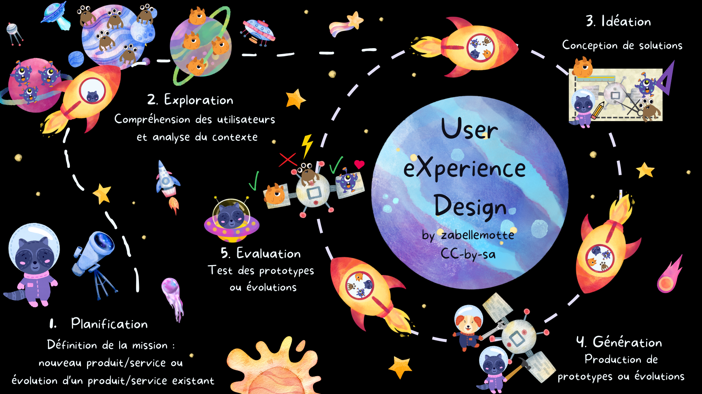

# UX Design by zabellemotte

<h4 id="definition"> C'est quoi le UX Design ? </h4>

Votre mission est <b>concevoir un nouveau produit/service ou de faire évoluer un produit/service existant</b>&nbsp;?

Découvrez comment atteindre cet objectif en veillant à <b>impliquer les utilisateurs</b> tout au long du processus de conception avec le User eXperience Design !

L'approche est structurée en <b>5 étapes</b> qui inspirent la structure de ce site :
<ol>
<li>Planification : Définition de la mission</li>
<li>Exploration : Compréhension des utilisateurs et analyse du contexte </li>
<li>Idéation : Conception de solutions </li>
<li>Génération : Production de prototypes ou évolutions </li>
<li>Evaluation : Test des prototypes ou évolutions </li>
</ol>

Les trois dernières étapes sont à envisager de manière itérative pour conduire la finalisation du produit et ses évolutions.

Ne perdez plus jamais la main sur vos projets, gravitez sur la même orbite que vos utilisateurs !

<h4 id="pourquoi"> Pourquoi impliquer les utilisateurs ? </h4>
Les raisons qui justifient d'impliquer les utilisateurs dès la gestation d'un projet sont nombreuses :
<ul>
<li>moins de risque de dépassement du budget ou du temps de développement</li>
<li>besoins mieux cernés, donc maintenance évolutive allégée</li>
<li>meilleure expérience d'utilisation, adoption facilitée, productivité augmentée, temps de formation minimisé</li>
<li>erreurs et incidents de supports moins fréquents</li>
</ul>

<b>En bref, impliquer les utilisateurs dès la gestation d'un projet permet d'optimiser la gestion des ressources et de l'expérience.</b>

<i>Adapter un outil en production coûte 10 fois plus de temps que de l'adapter pendant la phase de design.</i>  
Tom Gilb, ingénieur système spécialiste des méthodes qualité

 Quelques références sérieuses sur le retour sur investissement du UX design:
<ul> 
<li> Bias, R. G., & Mayhew, D. J. (2005). Cost-Justifying Usability: An Update for the Internet Age. Morgan Kaufmann. </li>
<li> Maguire, M. (2001). Methods to support human-centred design, International Journal of Human-Computer Studies, Volume 55, Issue 4, Pages 587-634, ISSN 1071-5819, <a href="https://doi.org/10.1006/ijhc.2001.0503" target="_blank">
https://doi.org/10.1006/ijhc.2001.0503 </a></li>
<li> International Organization for Standardization. (2019). Ergonomics of human-system interaction — Part 210: Human-centred design for interactive systems (ISO 9241-210:2019). ISO. 
<a href="https://www.iso.org/standard/77520.html" target="_blank">https://www.iso.org/standard/77520.html </a></li>
<li> Sheppard, B., Sarrazin, H., Kouyoumjian, G., & Dore, F. (2018). The business value of design. McKinsey & Company <a href="https://www.mckinsey.com/capabilities/tech-and-ai/our-insights/the-business-value-of-design" target="_blank"> https://www.mckinsey.com/capabilities/tech-and-ai/our-insights/the-business-value-of-design</a> </li>

<h4 id="qui">Qui suis-je ?</h4>

  
  

Je m'appelle Isabelle Motte et je gère des projets informatiques depuis plus de 20 ans. Ce site vise à partager mes pratiques en matière de <b>gestion des enjeux utilisateurs</b>.
Il référence les méthodes qui me semblent intéressantes et simples à mettre en oeuvre. Je mixe des références issues des <b>théories de gestion de projet et du UX Design</b>.
Mes pratiques en UX Design ont été renforcées par ma participation en 2026 au <a href="https://husci.be/formation/certificat-inter-universites-en-user-experience-design-and-research-ux/"> Certificat inter universités en User Experience Design and Research (UX) cordonné par l'Université Libre de Bruxelles </a>. 
  

